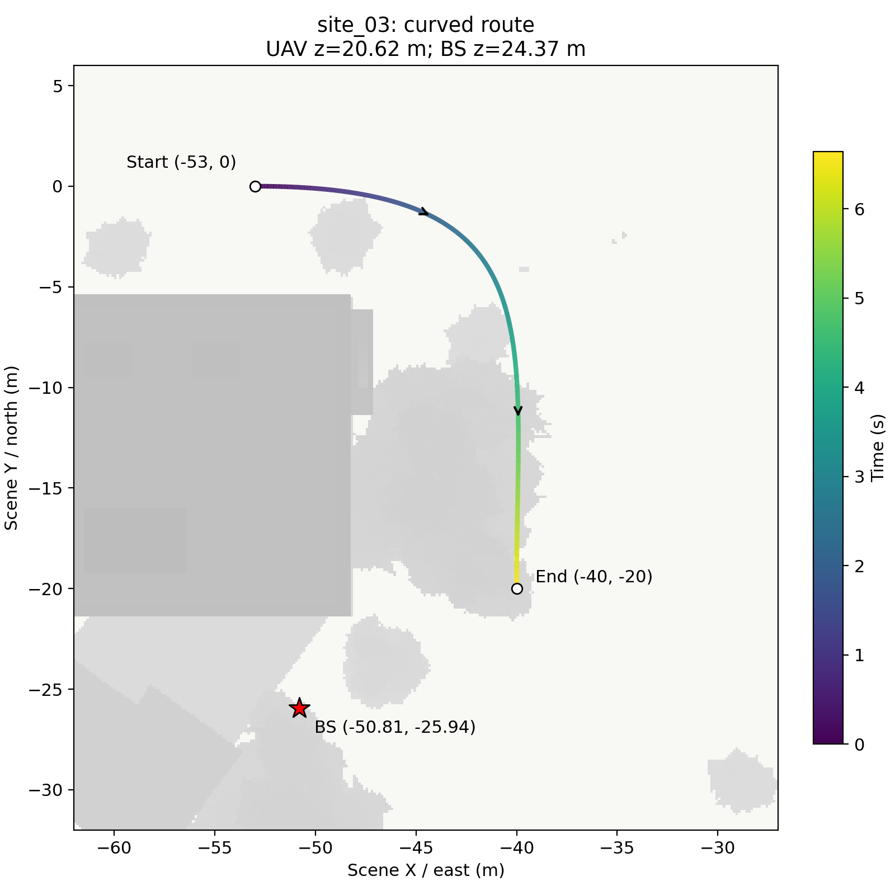
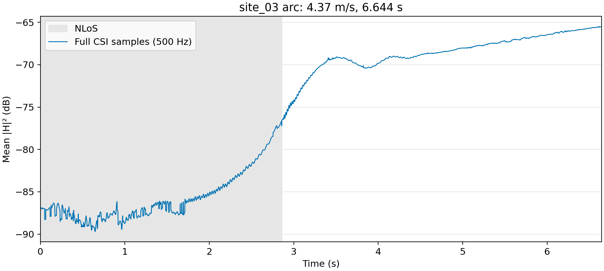

# site_03 弧线路径 001

本次仅生成一条路径及 CSI，没有生成 RGB 或训练模型；不改动之前的数据集。

- 基站位置：`(-50.8122, -25.9407, 24.3687)` 米，天线配置与朝向保持原 `site_03_route_00` 的设置。
- 起点：`(-53, 0, 20.6207)`；终点：`(-40, -20, 20.6207)`，均为 SimART 世界坐标。
- 用三次 Bézier 曲线连接，控制点为 `(-38, 0)`、`(-40, -7)`；按弧长近似匀速参数化。不是折线路径，也不是严格圆弧。
- 高度沿用原轨迹：20.62 米；速度约 4.367 米/秒；长度约 29.015 米；时长 6.644 秒。
- 真实导出场景网格的分段距离检查通过，包含曲线与检查线段的偏差界；表面间距下界约 2 米（检查值在 2 米处封顶）。
- CSI 为 500 Hz，共 3,323 帧，每帧 64×128 复数矩阵。沿用 3.5 GHz、128 子载波、30 kHz 子载波间隔，以及上一批最终的射线和候选补全设置。

## 俯视图

底图为实际 UE 网格的俯视投影。路径颜色表示时间，星号是固定基站，箭头表示飞行方向。上北下南。

投影包括树木等低于飞行高度的物体，平面重叠不代表三维碰撞。

## CSI 增益随时间变化

使用每个时刻的完整 CSI，先对天线和子载波取 `mean(|H|²)`，再取 `10 log10`。这里是信道增益，不是包含发射功率的接收功率。曲线没有平滑、插值或删点。灰色区间表示射线结果中不存在 LoS 路径。

[矢量 PDF](02_csi_gain.pdf) · [全部曲线数据 CSV](gain.csv) · [结果摘要](summary.json)

本次全程存在有效路径；约 2.86 秒由 NLoS 转为 LoS。增益范围约 −89.70～−65.49 dB，相邻 2 毫秒点的最大增益变化约 1.72 dB。总体呈较连续的增强过程，仍保留 NLoS 段的细小波动；没有人为处理为平滑曲线。

## 数据与代码

完整 CSI 保存在服务器 `/root/autodl-tmp/csi-visual-occlusion-v1/debug/site03_arc_001/`，不上传大矩阵。此目录包含两张图的 PNG/PDF、绘图数值 `plot_data.npz`、配置和生成/绘图脚本副本。生成脚本依赖服务器原仿真环境与场景；服务器运行入口为原目录中的 `run.py`。`plot_data.npz` 可直接读取全部轨迹坐标、时间、增益及 LoS 信息。
