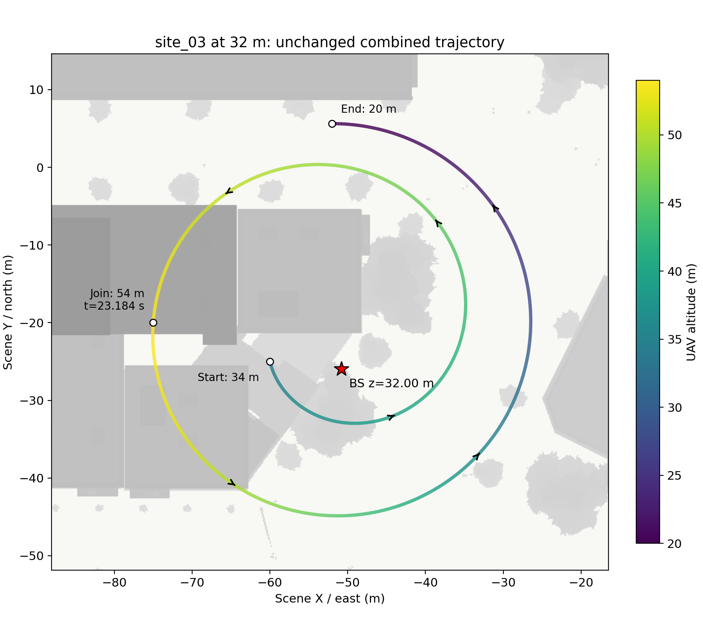
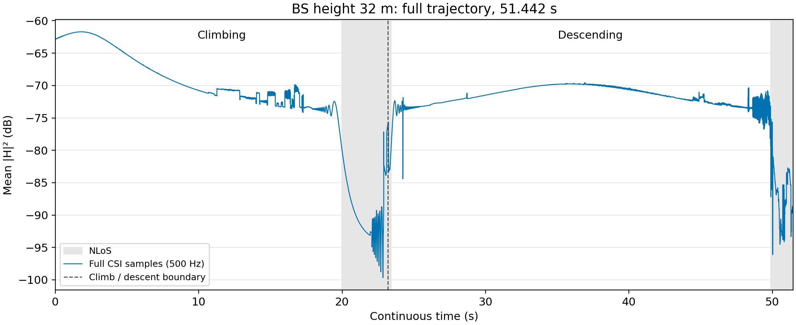
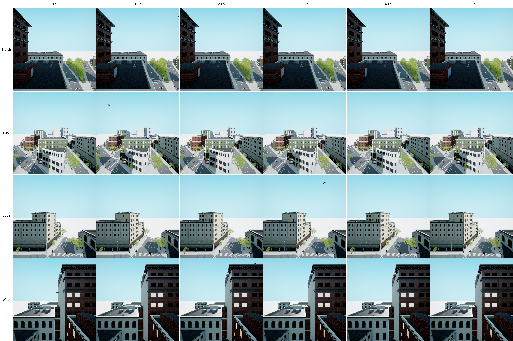

# site_03：基站与四相机升至 32 米

基站从 24.369 m 升至 **32 m**，位置为 **(-50.812, -25.941, 32) m**。四个相机同样位于该位置。保持原有完整上升—下降轨迹不变，总时长 **51.442 s**；无人机高度从 34 m 上升至 54 m，再下降至 20 m。

天线朝向、频段、阵列及射线仿真参数保持不变；同步提升天线目标点高度，使阵列仍朝向原来的水平方向。全程重新生成 **500 Hz、64 天线 × 128 子载波**的复数 CSI，共 **25,722 帧**，两段共有的连接点只计算一次。没有对增益曲线进行平滑或删点。

## 完整路径

颜色表示无人机高度，红星表示 32 米高的基站。

## CSI 增益

纵轴为每帧所有天线、子载波平均功率取 dB，灰色背景表示 NLoS；竖虚线为上升与下降段的连接处。

## 四视角 RGB

四行依次为 **北、东、南、西**；六列依次为 **0、10、20、30、40、50 秒**。相机水平朝向、视场角 100°，每张图 1024×1024。同一列在同一个无人机位姿采集，不追踪、不裁剪放大无人机。建议打开原图放大查看。

对比：[原 24.369 米基站结果](../site03_combined_004/)。本目录仅上传三张图片和说明；数据、代码保留在服务器 `csi-visual-occlusion-v1/debug/site03_bs32_005/`。
