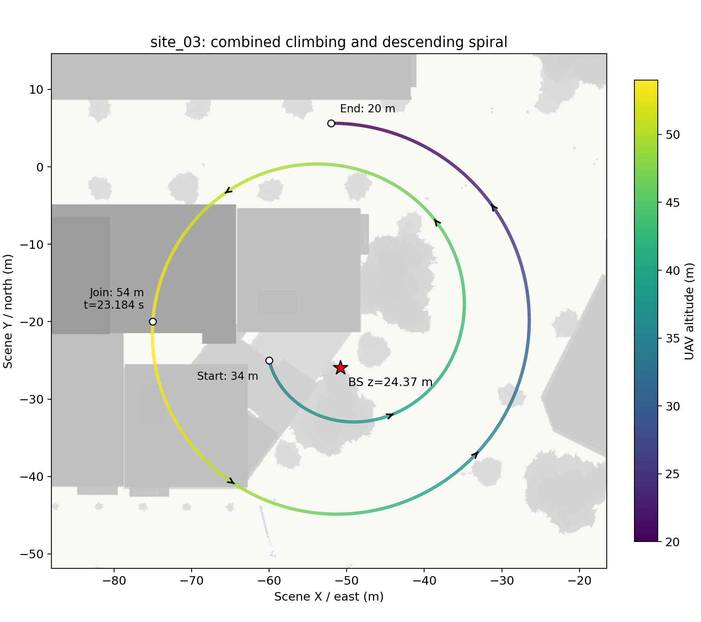
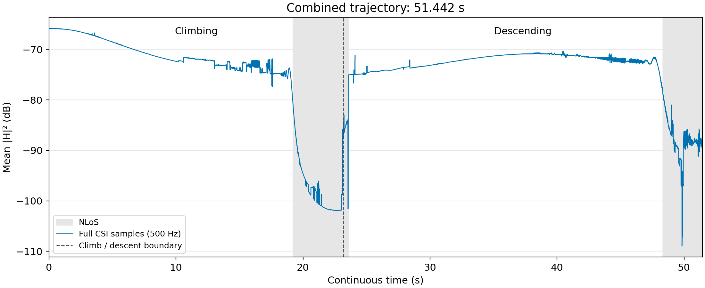
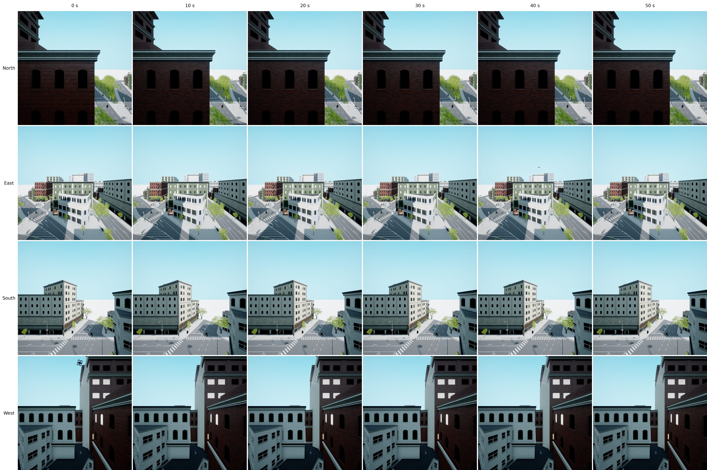

# site_03：上升与下降段合并展示

将 [上升段](../site03_spiral_002/) 与 [3/4 圈下降段](../site03_descent_003/) 接在一起，总时长 **51.442 秒**。从 **(-60, -25, 34) m** 出发，在 **23.184 秒**到达 **(-75, -20, 54) m**，随后继续逆时针下降，最终到达 **(-52, 5.63, 20) m**。基站位置及仿真配置保持不变。

CSI 曲线直接读取两段已生成的完整复数数据，使用连续时间轴绘制。纵轴为所有天线、子载波的平均功率取 dB；灰色区域表示 NLoS，竖虚线为两段连接处。没有平滑、插值或重新仿真。连接处保留两次独立仿真的原始值，未人为消除差异；路径位置连续，但垂直速度未重新优化衔接。

## 基站四视角 RGB（每 10 秒）

下图四行依次为 **北、东、南、西**，六列依次为 **0、10、20、30、40、50 秒**。沿合并轨迹采集，共 24 张真实 UE/AirSim 图像；各相机固定在上述基站位置，水平朝向，视场角 100°，单张分辨率 1024×1024。同一列的四张图来自相同的暂停无人机位姿。没有改变相机朝向来追踪无人机，也没有裁剪放大目标。

拼图保留单张原始像素，建议打开原图放大查看。原始数据和绘图代码保留在服务器。
