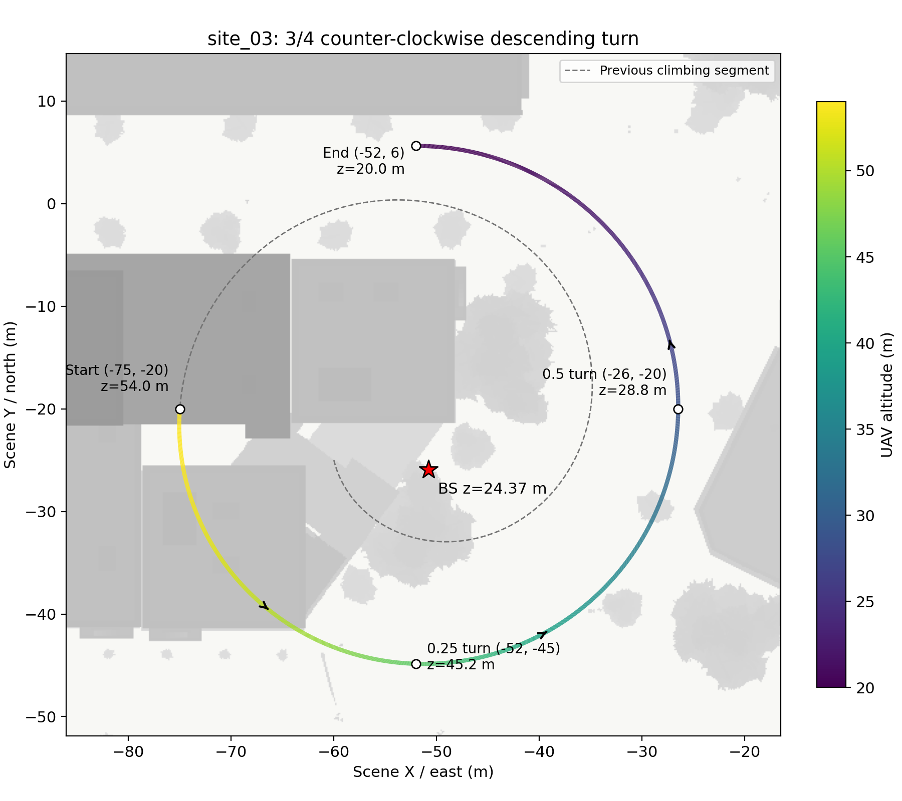
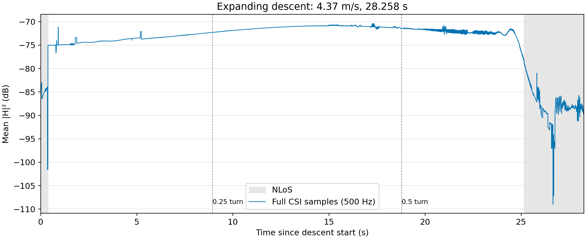

# site_03：续接 3/4 圈下降盘旋

从上一段上升盘旋的终点 **(-75, -20, 54) m** 出发，继续逆时针转 **3/4 圈**，平滑下降至 **(-52, 5.63, 20) m**。盘旋中心为 **(-52, -20)**，半径从 **23 m** 缓慢扩大至 **25.63 m**。速度约 **4.37 m/s**，新增段长 **123.40 m**，持续 **28.258 s**。下降段通过地图网格的建筑间距检查。

基站保持 site_03 的 **(-50.812, -25.941, 24.369) m**，天线和射线仿真设置与前两次调试一致。坐标方向为东 +X、北 +Y、上 +Z。

## 路径与高度

彩色曲线为此次新增下降段，颜色表示高度；灰色虚线为之前的上升段，仅作位置参照。上一段数据未修改，两段连接处的高度连续，但未重新优化上升转下降处的垂直速度衔接。

## CSI 增益

仅生成新增下降段的 CSI，采样频率 **500 Hz**，共 **14,130 帧**，每帧为 **64 天线 × 128 子载波**的复数矩阵。横轴从新增段起点重新计时。曲线为每帧所有天线和子载波的平均功率取 dB，使用全部原始样本，未进行时间平滑或删点；灰色背景表示 NLoS。

本目录仅上传两张图片和本说明。轨迹、完整 CSI 及代码保留在服务器 `csi-visual-occlusion-v1/debug/site03_descent_003/`。
