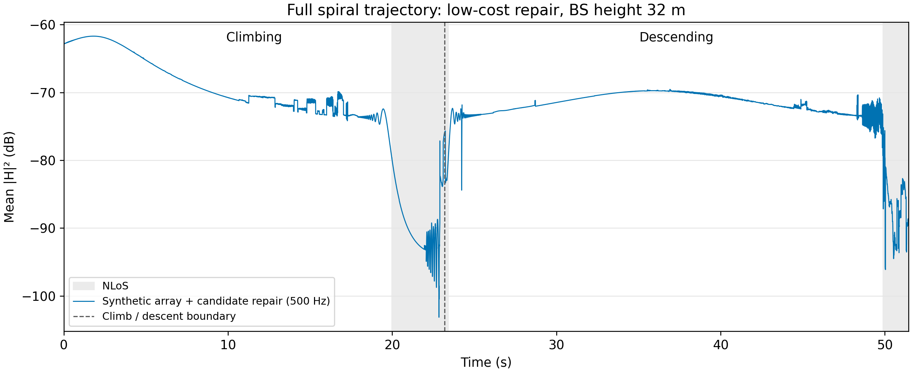

# 完整盘旋路径：低成本修复后的 CSI 增益

保持[之前的完整盘旋路径、32 米基站和场景](../site03_bs32_005/)不变，继续使用合成阵列，仅采用候选路径补全与重复反射候选去重修复。未采用逐天线计算，也未简化地图。

全程 **51.442 秒、500 Hz、25,722 帧**，每帧为 **64 天线 × 128 子载波**复数 CSI。纵轴为每帧全部天线及子载波的平均功率取 dB；灰色背景为 NLoS，虚线为上升段与下降段的连接处。

曲线直接由修复后保存的完整 CSI 计算，未做时间平滑、插值或删点。低成本修复减少了候选路径遗漏造成的反复跳变，但不消除真实几何遮挡或合成阵列近似导致的所有突变。本次完整 CSI 生成耗时约 **9.8 分钟**。
