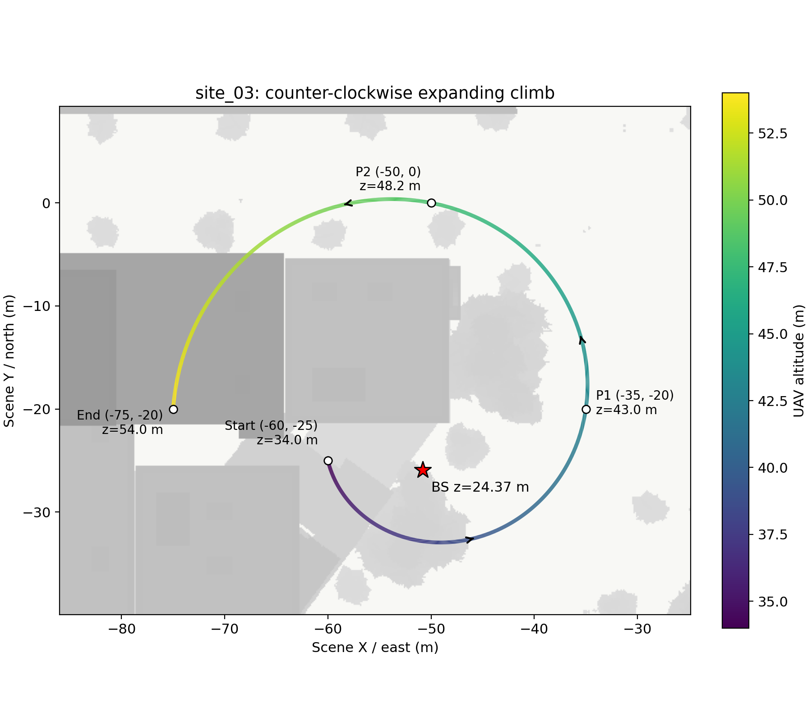
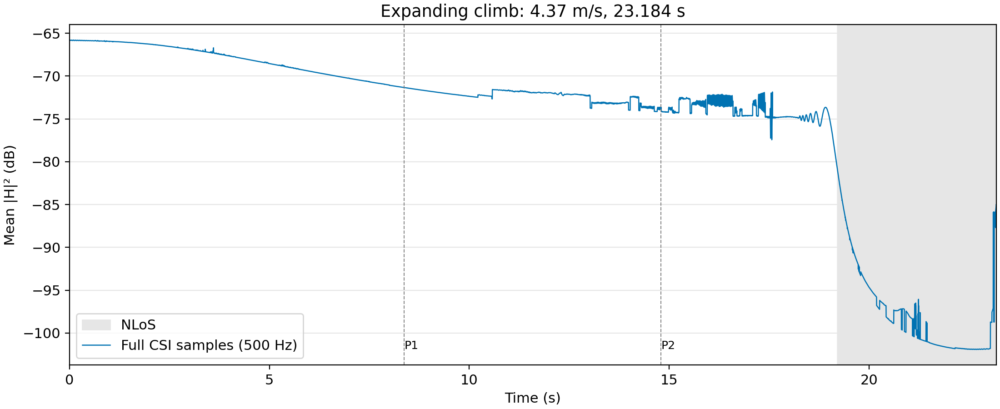

# site_03：逆时针外扩盘旋上升

保持 site_03 基站位置 `(-50.8122, -25.9407, 24.3687)` 米及原 CSI 仿真配置不变，本次只生成一条路径的 CSI，没有录制 RGB。

路径按顺序经过以下位置（SimART 米制坐标）：

| 位置 | 高度 | 经过时间 |
|---|---:|---:|
| 起点 `(-60, -25)` | 34.00 m | 0.000 s |
| P1 `(-35, -20)` | 43.02 m | 8.374 s |
| P2 `(-50, 0)` | 48.16 m | 14.797 s |
| 终点 `(-75, -20)` | 54.00 m | 23.184 s |

围绕 `(-52, -20)` 逆时针转约 0.91 圈，半径由 9.43 米连续增大到 23 米，持续爬升。路径长约 101.24 米，速度约 4.37 m/s。高度结合沿途真实场景网格确定，保留屋顶上方余量，避障检查通过。

## 路径俯视图

颜色表示高度，箭头表示飞行方向，红色星号是固定基站。灰色底图来自真实网格的俯视投影；飞行路径高于沿途建筑，投影重叠不代表碰撞。

## CSI 增益

500 Hz 采样，共 11,593 帧。增益为 `10 log10(mean(|H|²))`，对 64 根天线和 128 个子载波取平均，不包含发射功率。使用全部采样点，没有平滑、插值或删点。灰色区间表示射线结果中没有 LoS；虚线标出经过 P1、P2 的时刻。

全程存在有效传播路径；约 19.21 秒从 LoS 转为 NLoS，后段明显衰落。增益范围约 −101.92～−65.80 dB，图中的局部波动和末端变化均保留。

本目录仅上传这两张图及本说明。完整 CSI、配置和代码保留在服务器 `/root/autodl-tmp/csi-visual-occlusion-v1/debug/site03_spiral_002/`。
