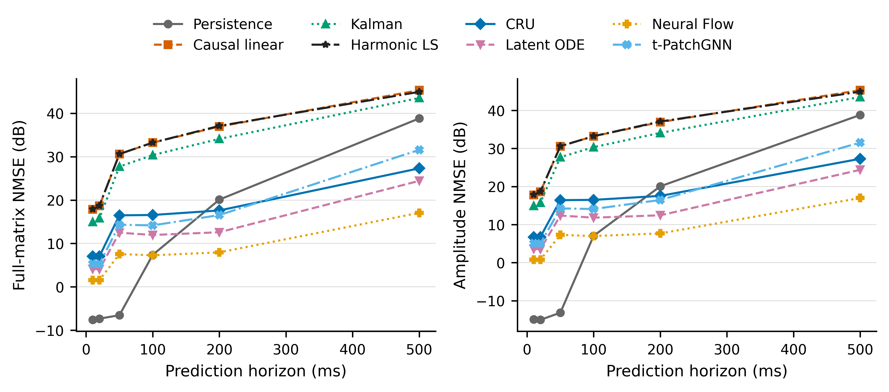
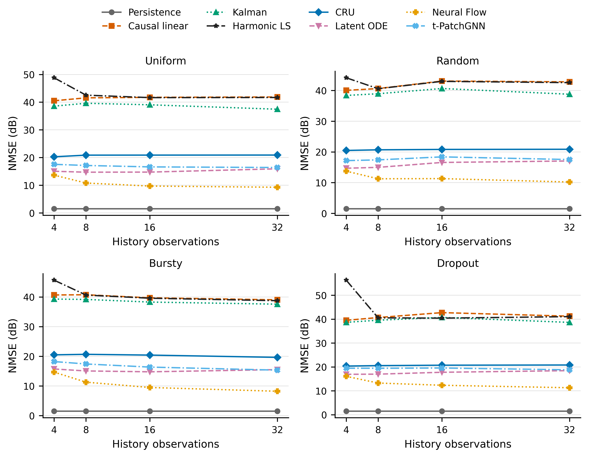
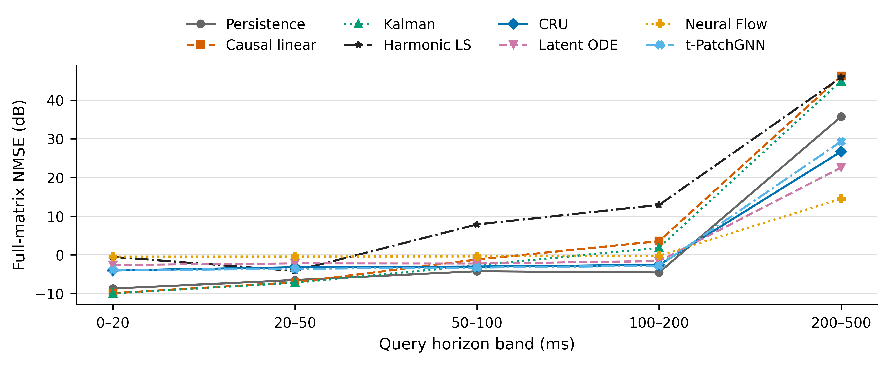
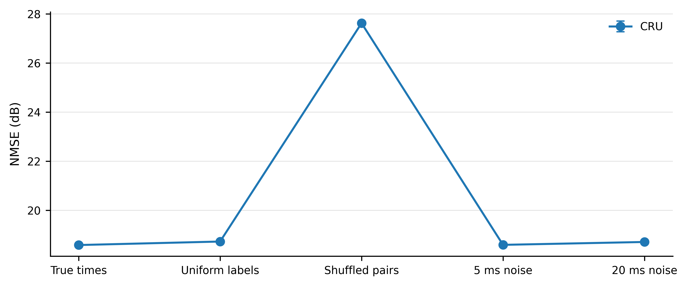
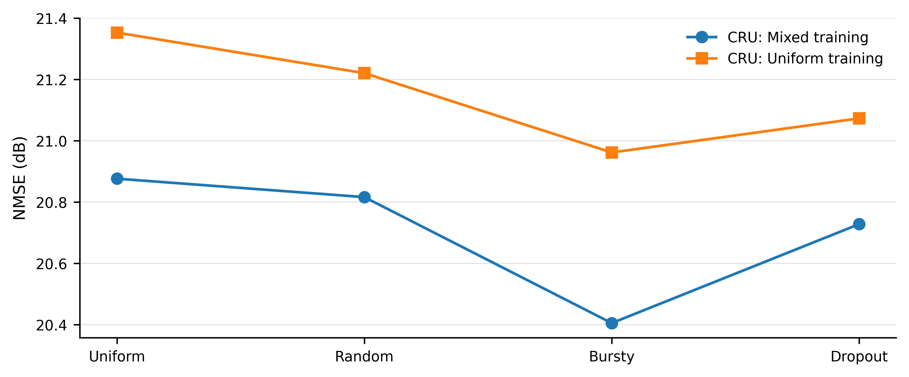
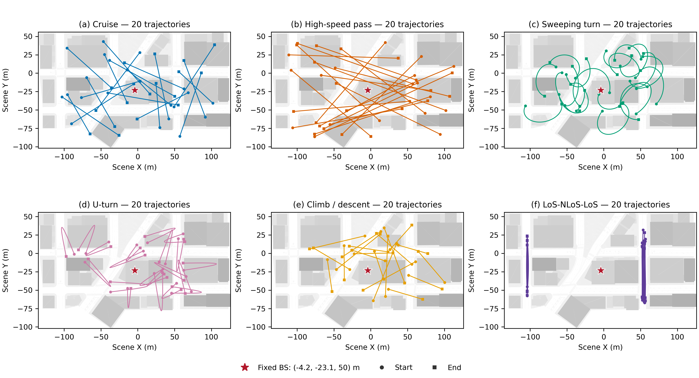
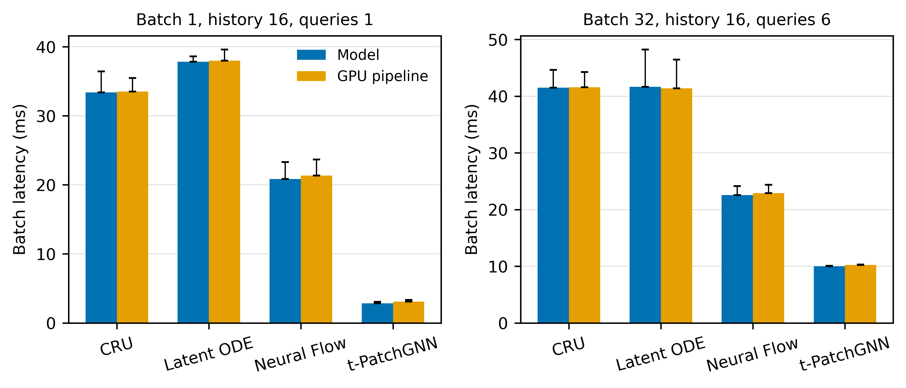
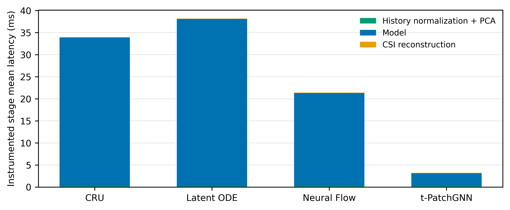

# 非均匀时间戳 CSI 预测实验结果

本文件夹保存单基站、固定城市地图下的 **V2 几何参考 CSI** 实验说明、最终结果和图片。这里的 `runs/main_v1` 是沿用的运行目录名，实际使用的是 V2 数据。

## 建议阅读顺序

1. [最终结果解读](docs/FINAL_INTERPRETATION.md)：先看结论、深衰落尾部和模型训练稳定性。
2. [完整结果与分析](docs/RESULTS_AND_ANALYSIS.md)：主测试、真实离网格查询、采样与时间戳实验、推理时延。
3. [数据集说明](docs/DATASET.md)：轨迹、基站、CSI 物理定义、划分和数据格式。
4. [模型适配说明](docs/MODEL_ADAPTATIONS.md)与[原论文/官方代码核对](docs/PAPER_AND_CODE_AUDIT.md)。
5. [实验协议](benchmark/实验协议.md)、[CSI 参考定义](docs/CSI_REFERENCE.md)与[过程观察](docs/OBSERVATIONS.md)。

## 本轮完成了什么

- 120 条无碰撞运动学轨迹，包含巡航、高速、连续转弯、折返、升降和遮挡，每条 8 秒。
- 500 Hz 完整复数 CSI，共 480120 帧，每帧 64 根天线 × 128 个子载波；验证/测试另有 3456 个真实离网格查询标签。
- CRU、Latent ODE、Neural Flow、t-PatchGNN 各三个种子的主训练，以及一次均匀采样对照训练，共 13 次训练。
- 保持、线性、Kalman、谐波拟合对照；预测提前量、历史数量与时间布局、时间戳误差、训练采样分布及 48 组推理时延测量。

**流程已经跑通，但还不能声称所有场景都能可靠预测。** 多数常规时刻具有可预测性，少数深衰落却主导逐目标相对误差均值；部分模型还存在输出收缩和种子敏感性。完整结果保留所有预定测试样本，没有人工平滑或删除困难轨迹。谐波基线的有限精度可辨识问题已修复，下列图表均使用重算后的最终结果。

## 结果图片

### 预测提前量

[矢量 PDF](runs/main_v1/figures/prediction_horizon_complex_and_amplitude.pdf)

### 非均匀历史与观测数量

[矢量 PDF](runs/main_v1/figures/sampling_pattern_and_count.pdf)

### 真实离网格查询

### 时间戳与训练采样分布

### 地图、基站与轨迹

### 推理时延

其它场景分组图、LoS 切换图和绘图数据见 [结果图片目录](runs/main_v1/figures/)。时延不包含磁盘、传感器、网络或 CPU 到 GPU 的传输，具体协议见结果说明。

## 数值和文件来源

| 内容 | 位置 |
|---|---|
| 汇总数值及源文件路径 | [RESULTS_AND_ANALYSIS.json](docs/RESULTS_AND_ANALYSIS.json) |
| 各条件、模型及种子的原始汇总 | [runs/main_v1/results/](runs/main_v1/results/) 下的 `summary.json` |
| 逐轨迹、分位数、尾部与种子分析 | [interpretation/](runs/main_v1/results/interpretation/) |
| 时延原始测量与汇总 | [latency/](runs/main_v1/results/latency/) |
| 训练逐轮日志表 | [checkpoints/](runs/main_v1/checkpoints/) 下的 `history.csv`，此处不含权重 |
| 数据与窗口配置 | [data/](data/) |
| 绘图脚本 | [plot_results.py](plot_results.py) |
| 文档汇总脚本 | [summarize_results.py](summarize_results.py) |
| 导出文件校验清单 | [ARTIFACT_MANIFEST.json](ARTIFACT_MANIFEST.json) |

本次上传约 20 MiB 的说明和结果。未上传完整 CSI、ROS bag、模型权重、旧候选数据或全量逐目标预测数组。它们仍在服务器 `/root/autodl-tmp/csi-irregular-benchmark/`。

文档和来源 JSON 中保留的服务器绝对路径用于追溯，不是 GitHub 下载链接。配置目录仅包含元数据，不代表此仓库已含全部训练数据；预测使用说明中的命令针对服务器完整工程。绘图/汇总脚本读取现有结果即可，训练与射线追踪依赖不在本次上传范围。
