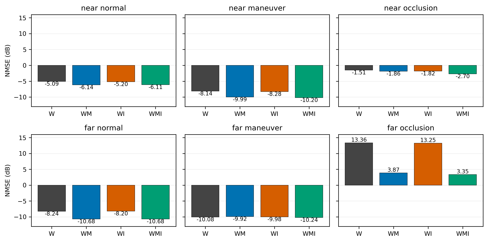
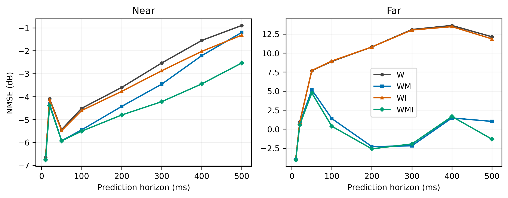
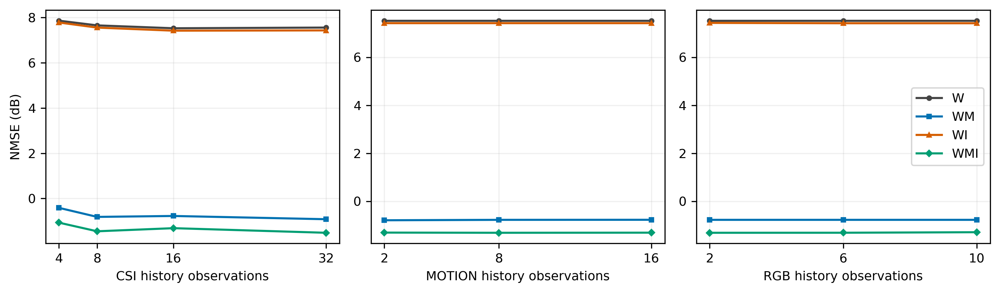
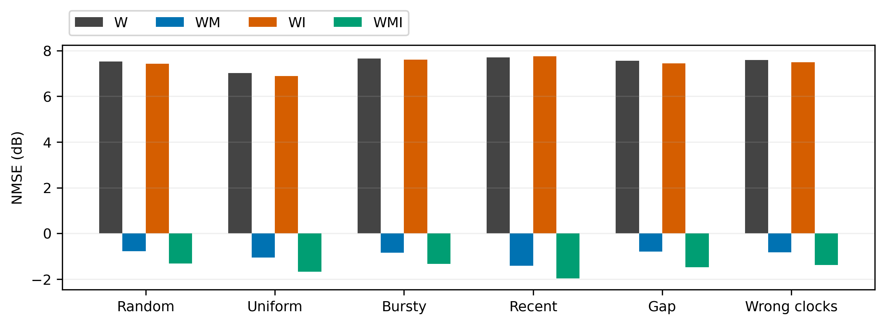
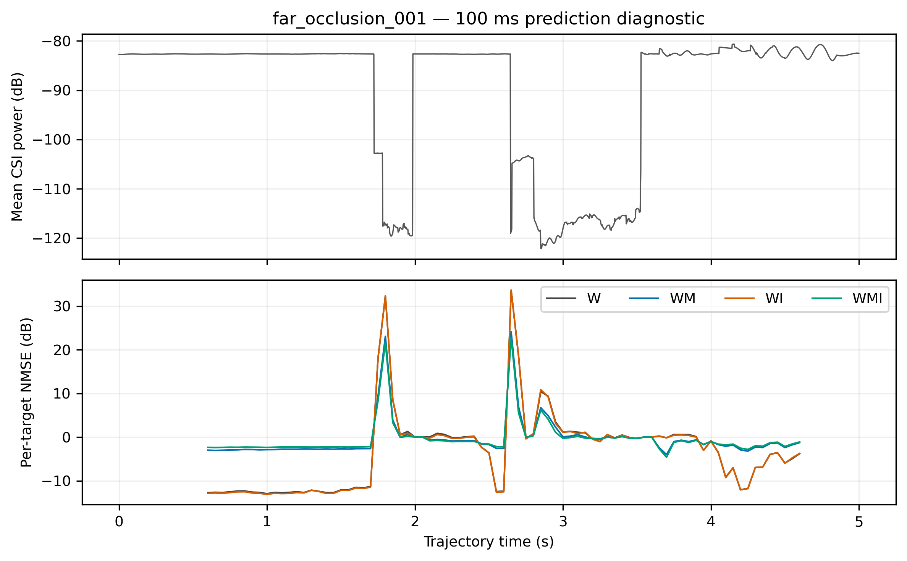

# 160 条轨迹的异步多模态 CSI 预测实验

## 数据与划分

固定基站位于 (-50.8122, -25.9407, 32.0) m。使用 v3 的 160 条五秒轨迹，近/远距离分别为到基站的三维距离 8–30 m / 30–100 m。每个距离组含正常 20、高机动 20、遮挡 40 条。每类按完整轨迹 8:1:1 划分，总计训练 128、验证 16、测试 16 条。同一路径的窗口不会跨集合；本实验不验证跨地图或跨基站泛化。

每条保存 2501 帧 500 Hz 的 64×16 复数 CSI、501 帧 100 Hz 的坐标/速度/轨迹姿态，以及四个固定方位各 101 张 20 Hz 的 400×400 RGB。基站相机水平视场角 100°、下俯 10°，四视角使用同一个冻结场景状态和轨迹时间戳。姿态不参与模型，接收天线朝向固定。CSI 使用此前确认的小金属物件移除场景、合成阵列、低成本候选修复和几何距离相位参考；无时间平滑或人为填补路径。视觉场景保留小物件。

载频 3.5 GHz，基站 8×8 阵列、接收端单天线。16 个频率偏移覆盖 −1.92 至 +1.89 MHz，具体值保存在 config.json；相邻频点间隔为 240 或 270 kHz。

## 样本与训练

历史范围为预测起点前 500 ms，预测范围为后 500 ms。有效起点按 50 ms 滑动（每条 81 个），训练每轮再加入不超过 24 ms 的起点抖动，并重新随机抽样。每轮共有 10,368 个训练窗口；窗口重叠并不意味着独立轨迹数增加。CSI 4–32 点、坐标速度 2–16 点、RGB 2–10 个四视角时刻，各流独立抽样，采用随机、均匀、近期密集、成簇和缺口模式。每个样本固定保留起点最新 CSI，所有辅助观测均不晚于起点。

每个训练窗口在未来 500 ms 的六个等长区间各随机查询一个时刻，不是固定六点。非网格目标通过相邻 500 Hz 复数 CSI 线性插值得到；这是离散参考数据的近似，不等于已验证更高频的真实信道。测试固定查询 10/20/50/100/200/300/400/500 ms。同一组实验中四模型使用完全相同的路径、起点、CSI 历史和目标。数量实验独立改变一种流，其余流采样保持不变。

CSI 输入和标签采用同一历史能量尺度归一化，尺度不使用未来信息。仅在整段历史为零时，使用预先由训练集非零帧能量中位数确定的固定尺度；运行时不需要读取整个数据集。位置减去基站坐标后除以 100 m，速度除以 20 m/s。图像只做 ImageNet 归一化，保持原生 400×400，通过冻结的 ImageNet ResNet50 layer3 后池化成每视角 8×8×1024 特征；未用全数据集背景均值。外部预训练仅用于该图像编码器，预测网络仅使用本次训练划分。

## 网络

四个模型 W、WM、WI、WMI 分别使用 CSI、CSI+坐标速度、CSI+RGB、全部三种流。均基于此前 scratch fusion v2 从随机参数开始训练，没有加载旧 CSI checkpoint。

复数 CSI 展平为 1024 个复系数。每系数的实虚部、相对最新值的实虚差和最新幅度组成五维特征，映射到 32 维，再加入实际时间编码。6 维位置速度映射到 32 维。图像保留四视角及 64 个空间位置，使用当前帧内空间中心化和历史图像差分，压缩后通过时间感知跨模态注意力与 CSI 历史融合。融合之后经过两层共享系数时序注意力，连续未来查询解码器输出复数倍率与复数修正量，并与最新 CSI 组合。内部逐系数相位坐标变换会在输出前逆变换，不改变数据或评价的相位定义。

预测器注册参数约 10.1 万（包括各版本未启用的分支），冻结 CNN 另计。四种模型共享骨架和训练设置，非零目标使用逐目标完整复数矩阵 NMSE，零目标使用历史尺度归一化的平方误差，再对所有目标平均。最新 CSI 为零时，内部相位参考改用非零历史或单位复数，不会把恢复预测强制锁成零。采用 AdamW、梯度裁剪、bfloat16 和验证集早停，仅保留验证集最优 checkpoint 用于测试。具体轮数和耗时见下表。

| 模型 | 最优轮次 | 验证 NMSE/dB | 测试 NMSE/dB | 训练小时 |
|---|---:|---:|---:|---:|
| W | 26 | -3.764 | 7.529 | 0.58 |
| WM | 30 | -3.661 | -0.774 | 0.62 |
| WI | 26 | -3.774 | 7.422 | 0.85 |
| WMI | 42 | -3.657 | -1.314 | 1.17 |

## 分场景结果

NMSE 对每个未来目标先计算所有复系数上的误差能量/真值能量，再对目标等权平均，最后取 10log10。下表没有先平均 dB，也没有忽略公共相位。零路径目标无法定义普通 NMSE，单独统计、不以零误差混入主指标；深衰落非零目标保留。全部原始分子、分母和有效标记存于本地 results/*.npz。

| 场景 | W | WM | WI | WMI |
|---|---:|---:|---:|---:|
| all | 7.529 | -0.774 | 7.422 | -1.314 |
| near | -3.289 | -3.857 | -3.553 | -4.513 |
| far | 10.360 | 1.014 | 10.260 | 0.512 |
| normal | -6.389 | -7.840 | -6.445 | -7.815 |
| maneuver | -9.003 | -9.956 | -9.048 | -10.215 |
| occlusion | 10.475 | 1.882 | 10.367 | 1.300 |
| near_normal | -5.095 | -6.137 | -5.200 | -6.105 |
| near_maneuver | -8.140 | -9.989 | -8.278 | -10.195 |
| near_occlusion | -1.510 | -1.863 | -1.823 | -2.700 |
| far_normal | -8.242 | -10.684 | -8.197 | -10.677 |
| far_maneuver | -10.081 | -9.924 | -9.984 | -10.236 |
| far_occlusion | 13.356 | 3.870 | 13.254 | 3.354 |

## 模态增益与解释边界

整体上，辅助模态模型中 WMI 的 NMSE 最低，相对 W 的误差变化为降低 86.95%（负值表示变差）。这反映当前数据、特征编码和训练配置的结果，不能直接等同于该模态在物理上没有信息。
- near：最低误差组合为 WMI，相对 W 降低 24.56%。
- far：最低误差组合为 WMI，相对 W 降低 89.64%。
- normal：最低误差组合为 WM，相对 W 降低 28.40%。
- maneuver：最低误差组合为 WMI，相对 W 降低 24.36%。
- occlusion：最低误差组合为 WMI，相对 W 降低 87.91%。

每个近/远正常或高机动测试类别仅有两条轨迹，遮挡类别各四条；相邻窗口高度相关。因此不能把上万个目标视为同等数量的独立实验。paired_route_bootstrap.csv 按整条轨迹配对重采样，提供不确定性参考，小样本类别的区间仍不稳定。只报告一个训练种子，不声称训练随机性的统计显著性。

若图像没有稳定收益，需区分固定背景占比高、远距离 UAV 像素过小、无线/视觉遮挡差异、冻结编码器对小目标不敏感，以及有限轨迹上的融合泛化问题。现有实验能够比较模态贡献，但不能仅凭总误差确定唯一原因。位置速度可能与近期 CSI 中已有运动趋势冗余。

## 历史数量与时间戳

默认测试使用 16 个 CSI、8 个运动观测和 6 个四视角图像时刻。图中每次只改变一条流的数量，其余观测固定。数量增加是否有益应以实测曲线为准，不能预设单调改善。

### csi 数量

| 数量 | W | WM | WI | WMI |
|---|---:|---:|---:|---:|
| 4 | 7.864 | -0.415 | 7.783 | -1.070 |
| 8 | 7.656 | -0.815 | 7.558 | -1.452 |
| 16 | 7.529 | -0.774 | 7.422 | -1.314 |
| 32 | 7.559 | -0.918 | 7.434 | -1.518 |

### motion 数量

| 数量 | W | WM | WI | WMI |
|---|---:|---:|---:|---:|
| 2 | 7.529 | -0.792 | 7.422 | -1.306 |
| 8 | 7.529 | -0.774 | 7.422 | -1.314 |
| 16 | 7.529 | -0.772 | 7.422 | -1.309 |

### rgb 数量

| 数量 | W | WM | WI | WMI |
|---|---:|---:|---:|---:|
| 2 | 7.529 | -0.774 | 7.437 | -1.315 |
| 6 | 7.529 | -0.774 | 7.422 | -1.314 |
| 10 | 7.529 | -0.774 | 7.422 | -1.292 |

扩展测试同时比较均匀、随机、成簇、近期密集和缺口采样。另将相同观测的时间戳改成等间隔，隔离错误时钟表征的影响。不同采样形状也改变观测覆盖，不能全归因于编码器；错误时钟实验则固定观测值。

## 辅助信息错配诊断

使用另一条测试轨迹同一历史时间范围的辅助观测替换当前观测，CSI、目标和时间戳保持不变。不重新训练，也不据此选择 checkpoint。错配变差说明网络依赖了正确关联；几乎不变提示依赖弱；错配变好则提示当前关联使用可能有害。但这不是单独识别因果机制的充分条件。

| 模型 | 正确关联/dB | 错配运动/dB | 错配 RGB/dB |
|---|---:|---:|---:|
| W | 7.529 | 7.529 | 7.529 |
| WM | -0.774 | 11.055 | -0.774 |
| WI | 7.422 | 7.422 | 7.421 |
| WMI | -1.314 | 11.089 | -1.315 |

## 图像几何覆盖

下表统计测试轨迹全程、20 Hz 时刻的 UAV 中心点是否进入任一相机视锥，以及同时满足射线场景 LoS 的比例。它不是图像可辨认率：没有考虑目标像素大小、冻结编码器敏感性或无线/视觉地图细节差异，也不是筛选样本的条件。

| 类别 | 中心点在视场内/% | 在视场内且 RT-LoS/% |
|---|---:|---:|
| near_normal | 100.00 | 100.00 |
| near_maneuver | 72.77 | 72.77 |
| near_occlusion | 78.71 | 50.50 |
| far_normal | 100.00 | 100.00 |
| far_maneuver | 100.00 | 100.00 |
| far_occlusion | 100.00 | 62.62 |

## 输出变化与能量诊断

下表在各窗口的历史能量归一化坐标下，对所有有效目标求能量和，并非未归一化物理功率的比值。预测变化能量/真实变化能量较小，说明预测变化不足以覆盖真实变化；若真实变化由少数大幅恢复段主导，也会使该比值很低，不能据此断言每个输出都等于保持。预测能量/真值能量较小则提示对大能量目标低估。两者应结合逐目标误差和中位数解释。

| 模型 | 预测变化/真实变化 | 预测能量/真值能量 |
|---|---:|---:|
| W | 0.0373 | 0.0591 |
| WM | 0.0311 | 0.0808 |
| WI | 0.0376 | 0.0595 |
| WMI | 0.0314 | 0.0784 |

## 困难轨迹与平均误差

逐轨迹结果保存在 per_route_metrics.csv。下表统计各模型最差 1% 有效目标占全部逐目标 NMSE 总和的比例；主结果仍保留所有这些目标，没有截尾或删除。

| 模型 | 最差 1% 的误差占比/% | 逐目标 NMSE 中位数/dB |
|---|---:|---:|---:|
| W | 92.45 | -7.232 |
| WM | 56.47 | -9.389 |
| WI | 92.41 | -7.263 |
| WMI | 51.94 | -9.167 |

以下诊断选择 W 平均 NMSE 最高的测试轨迹 far_occlusion_001，同时展示原始 CSI 平均功率与四模型固定 100 ms 预测误差。功率来自生成的数据，误差来自保存的测试结果；该轨迹只是困难案例，不代表全部数据。功率较低会放大相对误差，但是否预测错误仍需看预测与真实信道的变化，不能把所有大 NMSE 都归咎于分母。

## 零信道目标

完整数据中有 843 帧（约 0.21%）没有找到有效射线路径，按零 CSI 保存。这是当前有限射线配置的输出，并不证明真实环境中绝对没有传播能量。它们保留在训练及测试窗口内，训练有独立的零目标误差项；普通 NMSE 分母为零，因此不混入上面的 NMSE 平均。下表单独给出默认测试下的历史尺度归一化误差。

| 模型 | 零目标数 | 模型误差 | 保持误差 |
|---|---:|---:|---:|
| W | 12 | 0.00109321 | 0.0666667 |
| WM | 12 | 0.000406949 | 0.0666667 |
| WI | 12 | 0.00117966 | 0.0666667 |
| WMI | 12 | 8.99539e-05 | 0.0666667 |

本实验预测的是几何距离相位参考下的 CSI，不是未经处理的绝对载波相位。若要恢复绝对相位，还需对应的参考距离或其估计；不能把本实验精度直接解释为绝对相位预测能力。

## 幅度与相位诊断

除正式复数 NMSE 外，额外计算仅比较幅度的误差，以及允许每个预测矩阵利用真值校正一个公共相位后的误差。后者使用未来真值，因此仅用于分解误差来源，不代表实际可实现的预测性能，也没有用于选择模型。

| 方法 | 复数 NMSE/dB | 幅度误差/dB | 公共相位校正误差/dB |
|---|---:|---:|---:|
| W | 7.529 | 7.147 | 7.383 |
| WM | -0.774 | -2.256 | -1.434 |
| WI | 7.422 | 7.037 | 7.277 |
| WMI | -1.314 | -2.774 | -1.938 |
| Hold | 14.745 | 14.538 | 14.667 |

## 本次结论与下一步

1. **运动信息的增益有直接支持。** WM 相比 W 的收益不只出现在单条困难轨迹，正常飞行和近距离高机动也有改善。但远距离高机动的两条测试轨迹上，WM 并未一致优于 W；不能简单归纳为机动越强，运动模态必然越有用。
2. **RGB 的独立价值尚未得到充分验证。** WI 与 W 的总体差异小；WMI 的测试成绩优于 WM，但正确 RGB 与跨轨迹错配 RGB 的差异极小。相反，错配位置速度会严重恶化预测。这说明当前模型依赖正确的运动信息，却没有显示出对图像—轨迹语义关联的强依赖。不同模型各自训练产生的优化差异、固定场景上下文等也可能影响结果，不能仅凭 WMI 优于 WM 就证明图像提前预见了遮挡。
3. **远距离遮挡仍是主要失效场景。** 例如 far_occlusion_001 在 2.55 s 至 2.85 s 从 LoS 转为 NLoS，平均 CSI 功率约从 −82.67 dB 降到 −122.06 dB，前后均有多条有效路径。W 未能充分预测幅度下降，导致该目标 NMSE 达约 3702。公共相位对齐后整体误差下降很少，说明这个问题不能只通过去公共相位解决。WMI 缓解了该问题，但远距离遮挡类平均 NMSE 仍大于 0 dB。
4. **能处理可变输入，不等于充分利用所有时间信息。** 增加 CSI 历史通常有小幅帮助，但并非严格单调；增加运动和图像历史数量带来的变化很小。错误等间隔时钟实验没有使全部模态明显变差，甚至略有改善，因此目前不能声称模型已充分学会非均匀时间间隔。近期密集采样更有利于运动模型，也可能来自近期观测更相关，而非非均匀采样本身优越。
5. **结论是部分成功，而非全部解决。** 已获得完整可复现的数据与四模型，运动模态有效、困难遮挡仍有明显余量、视觉语义和时间戳利用不足。下一轮宜优先研究小目标/局部图像特征及正确-错配对照，检查衰落与恢复段的损失权衡，并用固定观测值的时间戳干预验证模型是否真正利用时间信息。不要靠删除深衰落样本或只换一个平均方式得到更好看的结果。

本次按全部有效目标等权报告主指标；轨迹 bootstrap 则先计算各轨迹均值、再按整条轨迹重采样，两者因有效目标数量略有差异，数值不要求完全相同。当前每类测试轨迹数量较少，且只有一个训练种子；结论限于该固定地图、基站与划分。

预测提前量曲线未必单调：不同提前量会落到不同目标时刻，少量衰落切换的相对误差足以影响平均值，不能把曲线局部下降解释为更远的未来更容易预测。跨网格查询测试也使用了另一组目标时刻，与默认查询的平均 NMSE 不能直接当作严格的难度对照。

## 文件位置与复用

服务器根目录为 `/root/autodl-tmp/csi-multimodal-160-20260910/`。`data/<轨迹名>/H.npy` 是 complex64、形状 `[2501,64,16]`；`csi_time_s.npy` 为对应轨迹时间，`paths.npz` 保存有效路径数及 LoS 等信息。`motion.npz` 包含时间、世界坐标、相对基站坐标、三维速度和四元数；`rgb/<方位>/<编号>.png` 为图像，`rgb_time_s.npy` 为模型使用的轨迹时间。`features.npy` 为冻结 CNN 特征缓存，不替代原图。跨模态对齐使用轨迹时间，不将引擎墙钟误作轨迹时间。

`runs/W|WM|WI|WMI/best.pt` 为四个验证最优模型，`latest.pt` 支持断点；旁边保存训练配置及各轮历史。`results/<模型>/<条件>.npz` 保存逐目标误差、能量、轨迹和查询时刻。`manifest.json` 给出完整的轨迹划分。GitHub 的 `training_metadata/` 和 `results/` 保存相应元数据及测试结果，不包含权重本体。`scripts/` 保留本次脚本快照；生成阶段依赖现有服务器的 AirSim、地图和 RT 修复环境，不能在没有这些依赖的空环境中直接运行。

## 参照与可复现性

保持参照 NMSE 为 14.745 dB，末两点线性外推为 40.194 dB。它们使用与模型相同的历史和目标，作为学习是否优于简单外推的检查。
数据、模型和完整逐目标结果保存在服务器 /root/autodl-tmp/csi-multimodal-160-20260910/。GitHub 同步报告、图、聚合 CSV、配置、划分及必要脚本，不上传数十 GB 的 RGB/CSI 或 checkpoint。所有图由保存的结果直接绘制，未人为平滑或删除困难轨迹。
