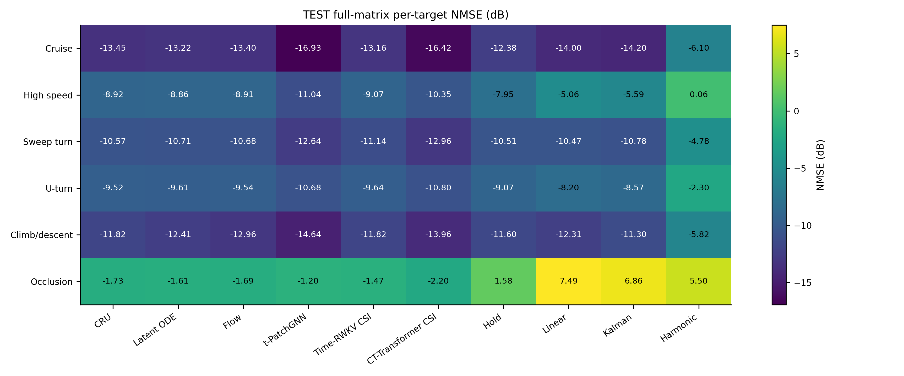
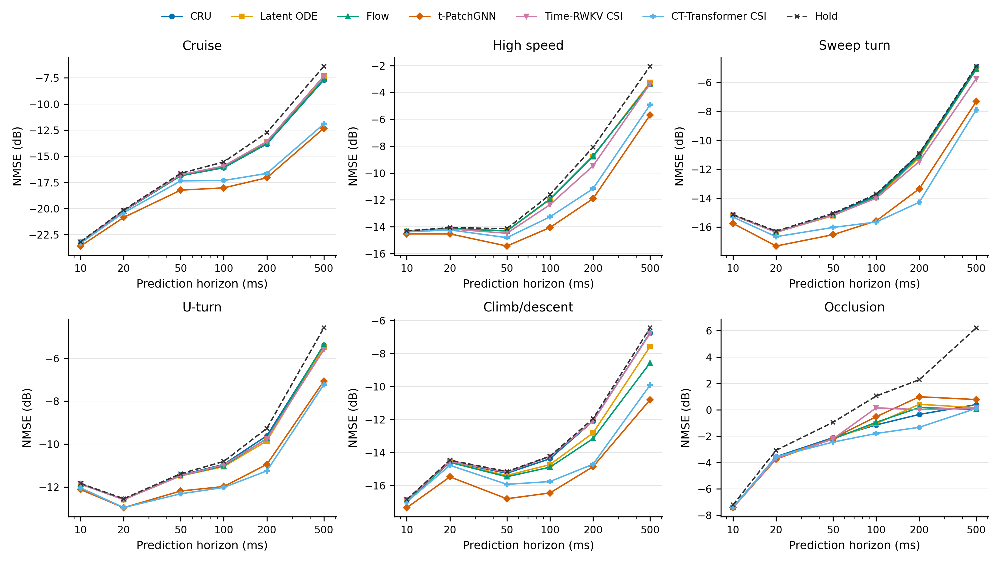
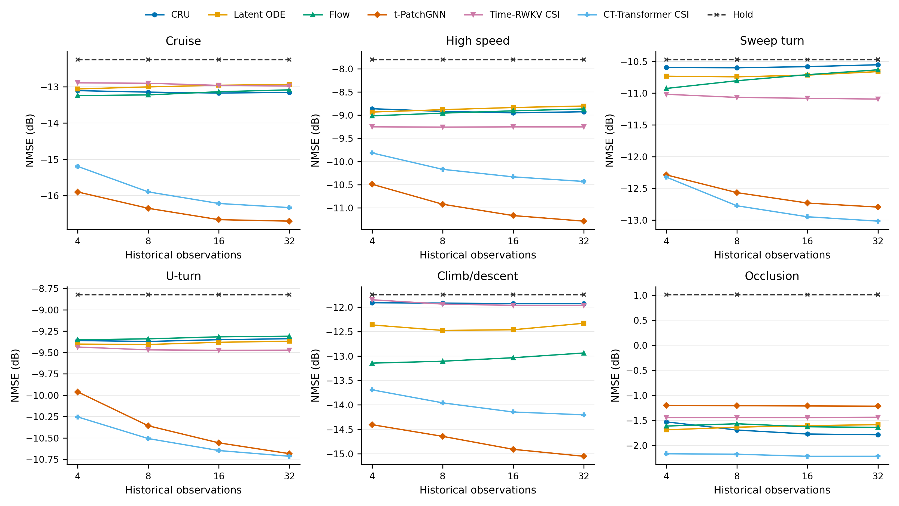
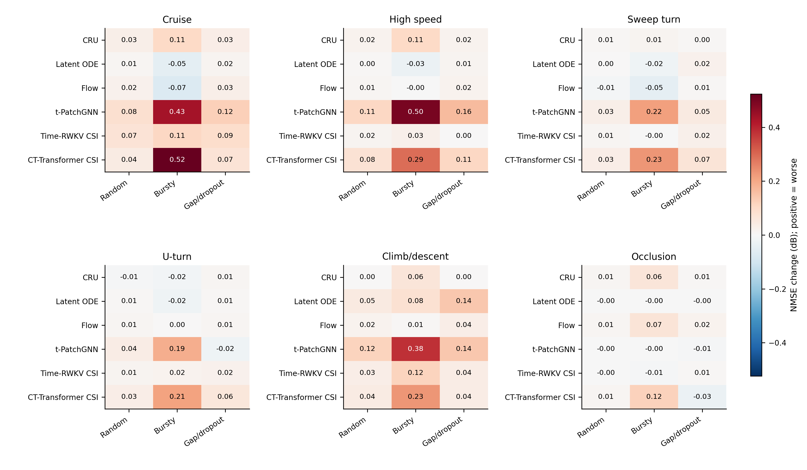
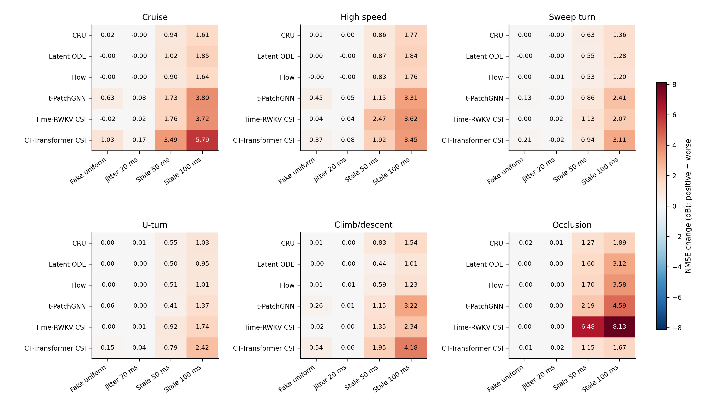
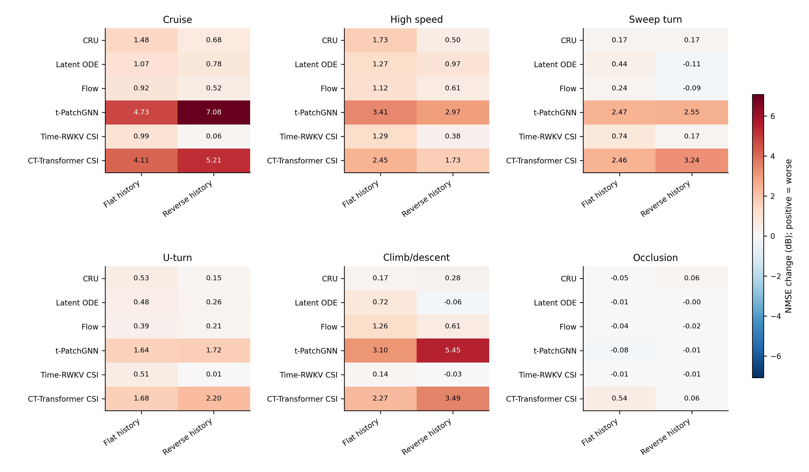
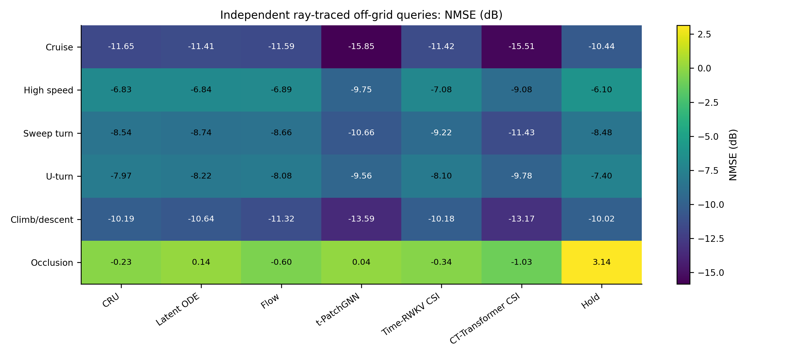
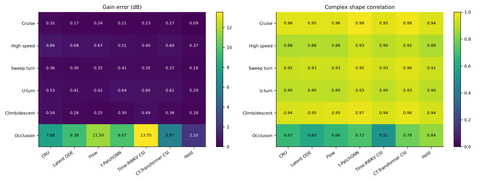
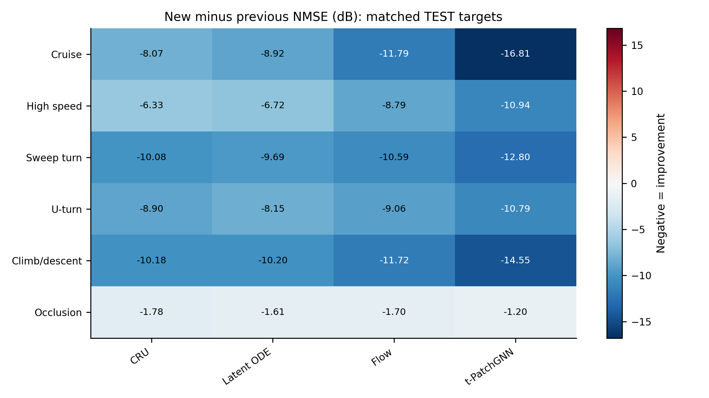
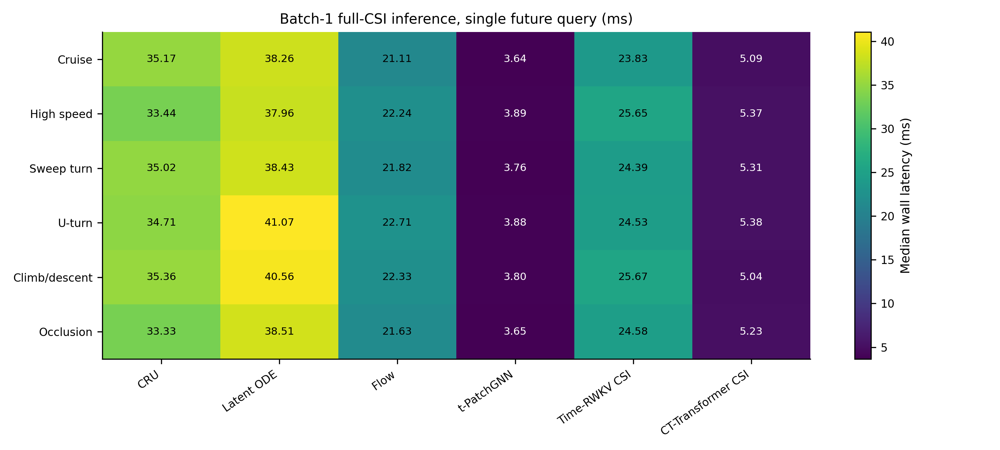

# 实验结果与分析

## 1. 本次实验回答的问题

本次研究的是：只有不等间隔的历史 CSI 时，模型能否利用历史演化预测指定未来时刻的完整 CSI；不同运动场景下哪些结构有效；观测数量、时间分布和观测过时会产生什么影响。六类分别训练，不是把六类混成一个预测器。

模型、归一化与损失配置来自此前小范围验证，本次每种模型仅训练一个种子。所有数值来自已保存的测试结果，没有删除难样本来改善最终分数，也没有平滑曲线。

## 2. 数据与测试协议

单一固定城市地图、一个基站 `(-4.2, -23.1, 50) m`，轨迹生成频率 1,000 Hz，CSI 生成频率 500 Hz。数据为几何距离相位参考的 CSI，具体阵列、频率、表示方式见[网络说明](NETWORKS_CN.md)。射线配置保留 LoS、镜面反射和绕射，最大深度 3，不开启漫反射和折射；场景几何焊接与反射共面性修正来自已有生成管线，本轮未重新改变 CSI。

| 类别 | 轨迹数量 | 单条时长 | 训练/验证/测试轨迹 | 训练/验证/测试独立组 |
|---|---:|---:|---|---|
| 巡航 | 20 | 8 s | 14 / 3 / 3 | 14 / 3 / 3 |
| 高速通过 | 20 | 8 s | 14 / 3 / 3 | 14 / 3 / 3 |
| 大角度转弯 | 20 | 8 s | 14 / 3 / 3 | 14 / 3 / 3 |
| 折返 | 20 | 8 s | 14 / 3 / 3 | 14 / 3 / 3 |
| 爬升/下降 | 20 | 8 s | 14 / 3 / 3 | 14 / 3 / 3 |
| 遮挡穿越 | 60 | 2.5 s | 42 / 9 / 9 | 14 / 3 / 3 |

遮挡类为新版短轨迹：20 个空间通道组，每组 3 个近邻变体，同组不跨数据划分。它们围绕几何验证的 LoS 边界构造，强调短时切换，而非要求每条都完成一次 LoS–NLoS–LoS 往返。因此 9 条遮挡测试轨迹仍只对应 3 个独立空间组。

图 0：六类实际轨迹的俯视图。颜色统一表示场景 Z 高度，灰色为城市表面投影，星号为基站。全部 160 条轨迹均来自本次数据版本；图中只做显示抽样，不改轨迹。各类别高度和速度范围见 [dataset_summary.csv](tables/dataset_summary.csv)。这些是有几何避碰约束的运动学轨迹，不是飞控动力学仿真。

主测试每类 600 个窗口，每窗历史跨度 400 ms，历史数量为 4–32，混合均匀、随机、成簇和中段缺测四种采样。未来查询为 10、20、50、100、200、500 ms，共 3,600 个目标点。非主测试的各项压力实验使用 200 个窗口，目标/截止时刻在对应对照间保持一致。真实离网格实验使用独立射线追踪的查询真值，数量由该数据集有效查询决定，不将插值 CSI 当作真值。

数据生成阶段已有有效链路窗口筛选规则；本次沿用既定有效窗口集合，不声称覆盖所有可能的无路径情况。在此集合内，最终评分未再按误差、增益下降或模型表现剔除样本。窗口可能重叠，也可能重复抽到相近截止时刻，不能把 600 个窗口当作 600 条独立轨迹。

### 指标口径

主指标先逐目标计算“完整复数 CSI 平方误差总和 / 真值能量”，在线性域对全部目标等权平均，最后转成 dB。它不是逐点 dB 的平均，也不是所有误差能量与所有真值能量的总比值；后者另存为能量加权指标。NMSE 不做预测后公共相位对齐。

同时保存增益 MAE、增益有符号偏差、幅度误差和复数形状相关性。形状相关性是归一化复内积模的平方，对整体复数倍率不敏感；它是补充结构指标，不代表主 NMSE 已经忽略公共相位。保持、线性外推、Kalman 和谐波外推作为传统参照；Kalman 参数只用验证集选择。

部分传统参照复用了旧实验结果，但已核对数据、评估设置、代码与文件校验值一致；六个学习模型全部重新训练和评估，没有复用旧网络分数。

## 3. 整体预测性能

下表是主测试 NMSE（dB，越低越好）。

| 类别 | 保持 | CRU | Latent ODE | Flow | t-PatchGNN | Time-RWKV CSI | CT-Transformer CSI |
|---|---:|---:|---:|---:|---:|---:|---:|
| 巡航 | -12.38 | -13.45 | -13.22 | -13.40 | **-16.93** | -13.16 | -16.42 |
| 高速 | -7.95 | -8.92 | -8.86 | -8.91 | **-11.04** | -9.07 | -10.35 |
| 转弯 | -10.51 | -10.57 | -10.71 | -10.68 | -12.64 | -11.14 | **-12.96** |
| 折返 | -9.07 | -9.52 | -9.61 | -9.54 | -10.68 | -9.64 | **-10.80** |
| 爬升/下降 | -11.60 | -11.82 | -12.41 | -12.96 | **-14.64** | -11.82 | -13.96 |
| 遮挡 | +1.58 | -1.73 | -1.61 | -1.69 | -1.20 | -1.47 | **-2.20** |

图 1：六个学习模型及四个传统参照的主测试完整矩阵 NMSE。

前五类中，各学习模型的平均 NMSE 均低于保持法，但不能把所有差异都描述为显著改善：例如转弯类 CRU 仅改善约 0.06 dB。t-PatchGNN 在巡航、高速和爬升/下降表现最好，CT 在转弯、折返最好；各类最优模型比保持降低约 1.73–4.55 dB。二者在部分场景差距也很小，例如折返约 0.12 dB，单种子结果不足以证明稳健排序。

保持并非所有场景中最好的传统方法。巡航中 Kalman 为 -14.20 dB，比 CRU、Latent ODE、Flow 和 RWKV 更好，但仍不及 t-PatchGNN 和 CT。因此结论是“若干适配模型学到了有效演化”，不是“任何神经网络都优于所有简单方法”。

## 4. 预测范围扩大后会怎样

图 2：六类数据在六个查询时域的 NMSE；各点分别评价对应未来时刻，而非递归滚动输出。

总体上，较远查询更难，t-PatchGNN 和 CT 在前五类的中远期仍有优势。但曲线不是每一段都单调：部分转弯、折返或爬升轨迹在 20–50 ms 的误差可能低于 10 ms。不同查询对应不同真值能量、局部干涉状态和有限的测试轨迹，不能把跨时域的平均曲线当作同一误差必然递增的理论关系。本图保留这些真实非单调段。

本次没有把模型输出递归送回作为新历史，也没有验证 0.5 秒以外的预测能力。

## 5. 历史数量和采样方式

图 3：固定历史首尾时刻和查询目标，以随机内部采样比较 4、8、16、32 个历史观测。

巡航中 t-PatchGNN 从 4 点的 -15.90 dB 改善到 16 点的 -16.66 dB，32 点为 -16.70 dB；CT 对应 -15.20、-16.22、-16.33 dB。高速中也有类似趋势。更多历史可以有用，但边际收益递减，不能据此主张观测越密越好。遮挡中增加观测数量作用很小，说明瓶颈不只是输入点数不足。

图 4：固定 16 点、首尾时刻和预测目标，比较随机、成簇和中段缺测采样相对真实均匀采样的 NMSE 差值；正值表示变差。

本次随机采样和中段缺测造成的变化总体不大；成簇采样对较强模型更明显，例如巡航 CT 退化约 0.52 dB、t-PatchGNN 约 0.43 dB。不过这是保留了首尾观测、具有固定 400 ms 跨度的设计，不能推广为所有异步输入都不重要，也不能证明大段尾部缺测同样无害。

图 5：以 16 个随机观测为对照，分别错误地改报为均匀时间戳、添加 20 ms 标准差的内部时间戳抖动，以及让最新观测落后 50/100 ms。文件中 `timestamps_none` 表示“不施加时间戳扰动”，不是“不输入时间戳”。

“真实均匀采样”和“把随机观测错误标成均匀时间”是两回事。后者在巡航中使 t-PatchGNN 退化约 0.63 dB、CT 约 1.02 dB，表明真实间隔仍有价值。20 ms 内部时间抖动的影响相对较小，但端点保留，不能等同于完整时钟不同步。

最新观测过时的影响更大：巡航 CT 从 -16.22 dB 变为 -12.73 dB（50 ms）和 -10.42 dB（100 ms）；t-PatchGNN 从 -16.66 dB 变为 -14.93 和 -12.86 dB。该实验同时缩短有效历史覆盖，并增加从最后观测到查询的距离；最大有效提前量会超过训练的 0.5 秒，因此不能把全部退化单独归因于时间戳误差。

## 6. 模型是否真的利用了历史

图 6：保持最新观测和真值不变，将更早观测全部替换为最新 CSI，或逆转更早观测的顺序；数值为相对完整随机历史的 NMSE 增量。

前五类 t-PatchGNN 在逆序后退化约 1.72–7.08 dB，CT 退化约 1.73–5.21 dB。巡航 t-PatchGNN 的正常结果为 -16.66 dB，扁平历史为 -11.93 dB，逆序为 -9.58 dB。仅保留最新锚点不能解释正常输入时的较好结果，历史值及顺序确实对模型有作用。

这属于测试时输入干预，也造成一定分布偏移，不是本次重新训练了一个等容量的“只看最后一帧”模型。它支持历史依赖性，但不能单独证明模型学到了真实传播方程。遮挡 t-PatchGNN 对两类干预变化很小，CT 对扁平化有所退化、对逆序变化较小，表明遮挡预测中的历史利用明显弱于前五类。

## 7. 真实离网格查询

图 7：使用独立射线追踪生成的非 2 ms 网格查询真值，检验网络是否只能输出训练采样网格上的 CSI。

巡航中保持为 -10.44 dB，t-PatchGNN 为 -15.85 dB，CT 为 -15.51 dB；高速中分别为 -6.10、-9.75、-9.08 dB。前五类仍有明显收益，支持在已覆盖范围内对连续查询时间泛化。

离网格实验的截止时刻和查询分布与主测试不同，不能直接用两图绝对分数之差量化“离网格惩罚”；应在离网格实验内部比较方法。遮挡中 t-PatchGNN 为 +0.04 dB、CT 为 -1.03 dB，也说明主测试负 NMSE 不保证每项压力测试都为负。

## 8. 遮挡为何仍不能说已解决

图 8：左图为增益 MAE，右图为归一化复内积模平方。形状相关性越高越好，但不评价整体复数倍率。

遮挡主测试中 CT 的 NMSE 最好，为 -2.20 dB；但增益 MAE 为 5.97 dB，平均增益偏差为 -5.74 dB，形状相关性为 0.78。保持法增益 MAE 只有 2.10 dB，结构相关性约 0.84。Flow 和 RWKV 更明显：平均增益偏差约 -11.43 和 -13.51 dB。

这表明部分 NMSE 收益来自幅度收缩。逐目标 NMSE 以真值能量作分母，深衰落点上的过预测惩罚很大；模型在难以判断是否即将深衰落时可能倾向保守地压低预测。它与当前指标现象一致，但不是证明每个模型都只学会了常数缩放。

遮挡类验证集与测试集也差异很大，例如 CT 验证最优仍为正值，测试均值却为负值。两者只有三个独立空间组，局部遮挡结构和深衰落分布不同，不能当作大量独立同分布样本。当前能得出的结论是“CSI-only 在这些遮挡组上存在明显瓶颈”；尚未加入图像，所以不能宣称图像已经能解决该问题。按能量升降分组的统计保存在 [energy_change_groups.csv](tables/energy_change_groups.csv)。

## 9. 与旧版实验、推理开销的关系

图 9：相同测试目标上，本次与旧版 seed 17 的 NMSE 差值，负值为改善。四个共有模型均改善，前五类改善约 6.33–16.81 dB。但这同时包含输出锚定、相对历史、归一化和确定性潜变量等变化，不是单独的加法/乘法消融，不能把全部收益归因于一个模块。

图 10：所有训练退出后，在同一 RTX 4090D 上测量单样本、16 个历史观测、一个 100 ms 查询的完整 CSI 推理墙钟时延中位数。包括归一化、网络前向和固定基重建；不含磁盘读取、网络传输和构造样本。预热 10 次、测量 30 次。

本实现各类别中位时延范围约为：CRU 33.3–35.4 ms、Latent ODE 38.0–41.1 ms、Flow 21.1–22.7 ms、t-PatchGNN 3.64–3.89 ms、RWKV 23.8–25.7 ms、CT 5.04–5.38 ms。时间递推和 ODE 的 Python/小算子开销不可忽视，所以参数少不一定推理快，RWKV 也没有采用专门的融合 CUDA kernel。这里只比较当前实现，不代表原论文最佳部署速度。六查询结果和 p95 见 [latency.csv](tables/latency.csv)。

## 10. 目前可以下什么结论

本次足以支持：统一利用最新 CSI 锚点后，可以在多种运动场景学习到超出保持法的演化信息；t-PatchGNN 和 CT 是当前较值得继续研究的实现；在已测试设置中，最新信息的新鲜程度比轻度内部采样不均匀更关键；遮挡类需要同时考虑误差、增益偏差和结构保真。

仍不能据此认定所有模型具有稳定排名、所有异步程度都可处理、原论文方法已被精确复现，或完整 CSI 预测问题已经解决。主要边界是单地图、单基站、少量独立轨迹/空间组、单种子、有限的 4–32 点历史和 0.5 秒预测范围，以及固定压缩表示与相位参考。保留这些边界不会否定本次结果，反而能明确后续实验应验证什么。
