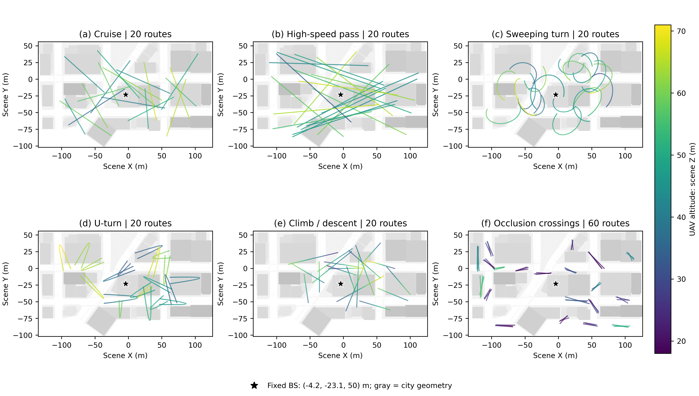

# 六类非均匀时间戳 CSI 预测：统一复数仿射预测头

本目录对应 **2026-09-07 完成的独立实验**：六类数据分别训练 CRU、Latent ODE、Flow、t-PatchGNN、Time-RWKV CSI 和 CT-Transformer CSI，每个模型仅使用 seed 17，共 36 个训练。不要与相邻目录中的旧版直接预测实验混用。

## 阅读入口

- [网络说明](NETWORKS_CN.md)：CSI 表示、归一化、统一输出头、六个网络的具体结构与维度、训练配置。
- [实验结果与分析](ANALYSIS_CN.md)：实验协议、完整结果、历史信息与非均匀采样的作用，以及遮挡预测的局限。
- [全部图片](figures/)：11 组 PNG/PDF，含六类轨迹地图和十组实验图。
- [原始汇总表](tables/)：模型结果、分预测时域结果、训练信息、时延、与保持及旧实验的比较。
- [轨迹绘图数据](data/trajectory_map.npz)与[重绘脚本](scripts/plot_trajectory_map.py)：无需访问服务器地图模型即可重画下图。



图：每个子图展示该类全部实际轨迹，包括训练、验证和测试划分；前五类各 20 条，遮挡类为新版 60 条短穿越轨迹。灰色为实际仿真城市几何，黑色星号为固定基站。六图共用高度色标，单位是 SimART 场景坐标系的 Z（米），不是相对地面的净空高度。俯视投影经过建筑物不等于发生碰撞，需结合飞行高度理解。完整数值范围见 [dataset_summary.csv](tables/dataset_summary.csv)。

## 最简结论

前五类主测试中，六个学习模型的平均 NMSE 都低于保持法，较明显的收益主要来自 t-PatchGNN 和 CT-Transformer CSI。历史顺序干预会明显削弱这两个模型，支持它们利用了历史演化信息。遮挡类的 NMSE 虽也降低，但增益低估和结构损失明显，不能把负 NMSE 当成遮挡问题已经解决。

这些结果证明本次训练和评估链路可以工作，并不意味着所有设计问题已经消失：每类仅三个独立测试轨迹/空间组，只有一个训练种子；新增两个 CSI 网络是论文思想的简化适配版本，不是原论文完整复现。

## 文件与复现范围

本次共保存 960 个评估组合的汇总结果：6 类 × 16 种测试设置 ×（6 个学习模型 + 4 个传统参照）。这是评估设置数量，不是 960 次独立训练或 960 个独立数据集。

服务器完整目录：`/root/autodl-tmp/csi-irregular-benchmark/runs/six_category_affine_s17/`。其中 `checkpoints/` 保存 36 组权重，`results/` 保存逐目标 NPZ 和结果来源校验。训练及评估代码位于 `experiments/six_category_affine_s17/`。本 GitHub 目录上传说明、图片、轻量数值结果和轨迹重绘素材，不上传大体积 CSI 数组或 checkpoint。

`tables/experiment_metadata.json` 的图列表是训练工作流最初生成的十组图；本次另外增加 `00_trajectory_families_altitude`，不属于新增训练实验。`ARTIFACT_MANIFEST.json` 列出整个发布目录的文件校验值。

重画地图图：安装 NumPy、Matplotlib 后运行：

```bash
python experiments/six_category_affine_20260907/scripts/plot_trajectory_map.py
```

地图背景在 PDF 中栅格化以控制文件大小；轨迹、标注和色标保留矢量绘制。原始轨迹仅按 10 ms 间隔取真实样点用于显示，未平滑或修改飞行路径。
