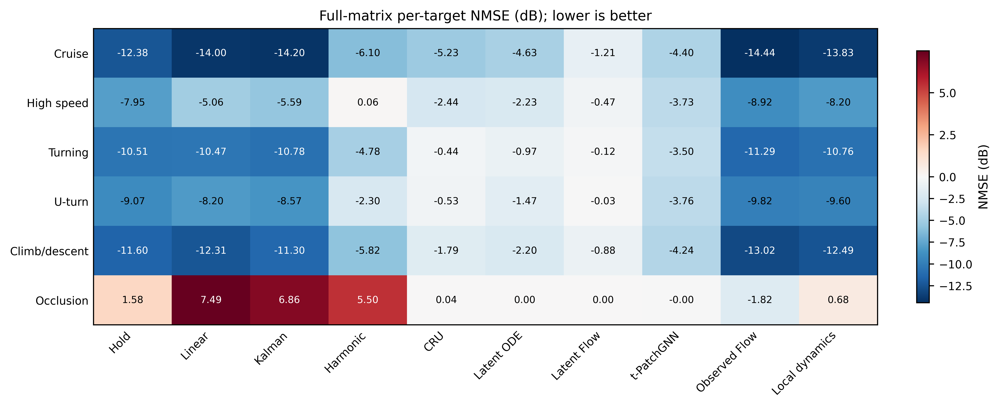

# 六类场景的非均匀时间戳 CSI 预测实验

本目录独立保存 2026-09-06 完成的六类分别训练实验，与之前的实验文件夹分开。

## 从这里开始

- [中文结果分析](ANALYSIS_CN.md)：主要结论、原因解释与适用边界，建议先读。
- [完整实验报告](RESULTS_CN.md)：全部方法的结果、七组图和各项受控实验。
- [数据与模型说明](METHODS_CN.md)：六类数据划分、CSI 表示、各模型结构及训练协议。
- [结果图](figures/)：600 dpi PNG 和嵌入字体的矢量 PDF。
- [精确结果表](tables/)：图表数据、逐种子结果、配对差、置信区间和增益诊断。

## 已完成的工作

六类场景为巡航、高速、连续转弯、折返、爬升/下降和新生成的短遮挡轨迹。

每类分别训练 CRU、Latent ODE、Latent Flow、t-PatchGNN、Observed Flow 和 Local dynamics，每种方法使用三个固定种子，共 **108 组完整训练结果**。其中 33 组复用数据、实现和配置一致的已有完整训练，另外 75 组为本轮新增。复用来源与权重哈希均有记录。

另外比较保持、线性外推、Kalman 和单频 Harmonic 四种简单方法。主测试和真实离网格测试使用全部三个训练种子，其余受控实验固定使用种子 17。共得到 **984 份逐目标评估结果、840 个实验—场景—方法汇总条目**，没有缺失方法或未齐的种子。

实验覆盖预测提前量、真实离网格查询、历史观测数量、采样分布、内部时间戳误差、近期观测缺失，以及遮挡和深衰落分组。

## 最重要的发现

1. **存在比保持更好的可学习动态，但不是所有模型都能利用。** Observed Flow 在六类总体平均 NMSE 上均优于保持；原四种方法的本次 CSI 适配在前五类均落后于保持。
2. **模型对时间信息的依赖不同。** Observed Flow 更受最新观测缺失的影响；单频拟合则对错误的内部时间标签十分敏感。不能把某一模型的弱敏感性解释为时间戳不重要。
3. **遮挡类不能只看一个平均 NMSE。** Observed Flow 的均值从保持的 +1.58 dB 改善到 −1.82 dB，但同时出现明显的增益低估，稳定 LoS 和能量加权指标有所退化。接近零输出的模型也可能比保持具有更低的均值，不能据此认为完整 CSI 预测成功。



图中越低越好；0 dB 对应与零矩阵输出相同的归一化误差量级，不是零预测误差。完整解释和其他指标见中文分析。

## 文件索引

| 路径 | 内容 |
|---|---|
| `figures/` | 七组 PNG/PDF 图 |
| `tables/overall.csv` | 各场景、各方法、各实验的跨种子汇总 |
| `tables/per_run.csv` | 每个训练种子的测试结果 |
| `tables/by_horizon.csv` | 各查询提前量的结果 |
| `tables/gain_diagnostic.csv` | 增益偏差、幅度与结构诊断 |
| `tables/representation_floor.csv` | 相同测试目标上的固定空间基重建误差 |
| `training_runs.csv`、`training/` | 108 组训练的配置、历史、最佳轮次、验证成绩、权重哈希及复用来源 |
| `dataset_summary.csv`、`datasets/` | 数据集划分、空间压缩及物理生成配置 |
| `protocol/` | 评价协议、实现检查与 CRU 数值精度说明 |
| `scripts/` | 只读取公开 CSV 的绘图代码 |
| `ARTIFACT_MANIFEST.json` | 本目录文件哈希清单 |

## 重新画图

安装 `numpy`、`pandas` 和支持外置图例的 `matplotlib>=3.8`，在本目录执行：

```bash
python scripts/replay_figures.py --tables tables --output reproduced
```

无需下载 CSI 或模型权重。此入口从精确汇总表重画图，不重新估计模型或置信区间。

## 服务器上的完整产物

项目目录：`/root/autodl-tmp/csi-irregular-benchmark`

- 本轮权重：`runs/six_category_v1/checkpoints/`
- 完整逐目标 CSV/NumPy 结果：`runs/six_category_v1/results/`
- 六类数据入口：`experiments/six_category_v1/data/`
- 训练与评估代码：`experiments/six_category_v1/`

本 GitHub 目录不包含大体积 CSI、bag、模型权重或第三方完整实现。复用权重在服务器上采用符号链接，迁移时需连同 `REUSED.json` 指向的源文件一起保存。

本实验使用几何距离参考 CSI，不是直接预测未知绝对公共载波相位。每类测试仅有三个独立轨迹或通道组，原方法也经过 CSI 适配；具体限制见分析与方法说明。
