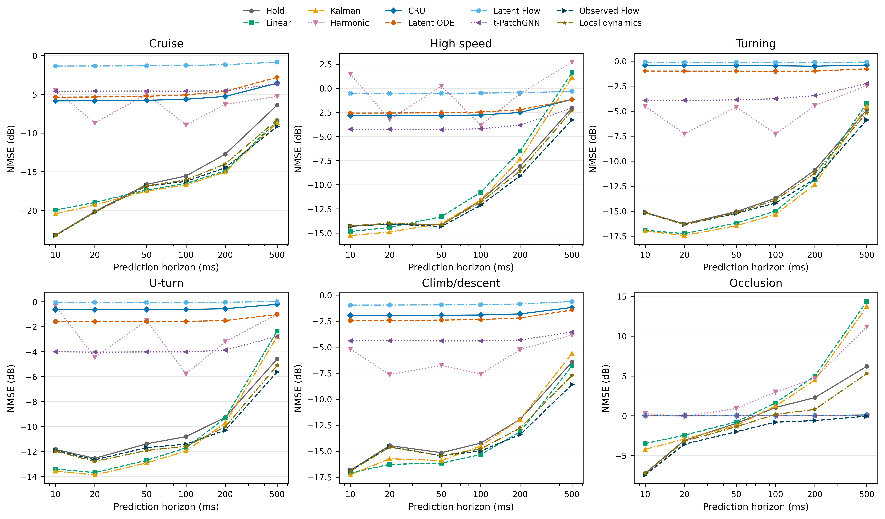
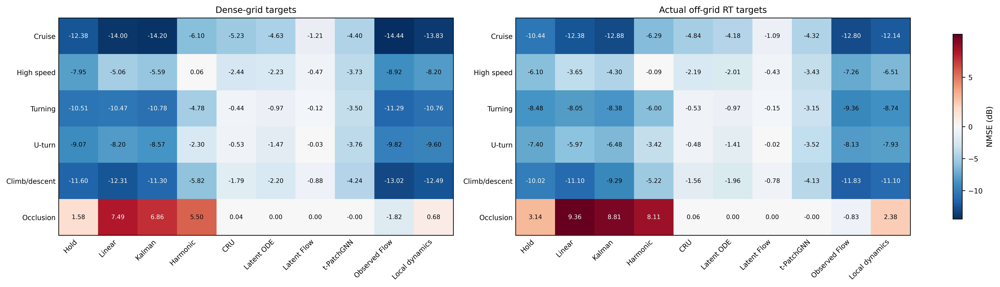
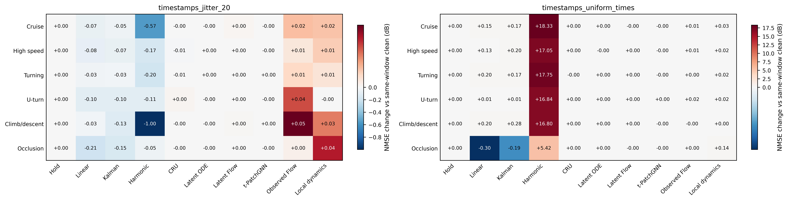
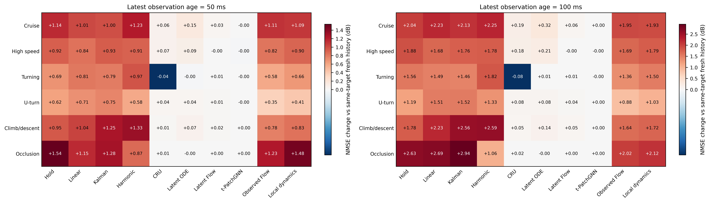
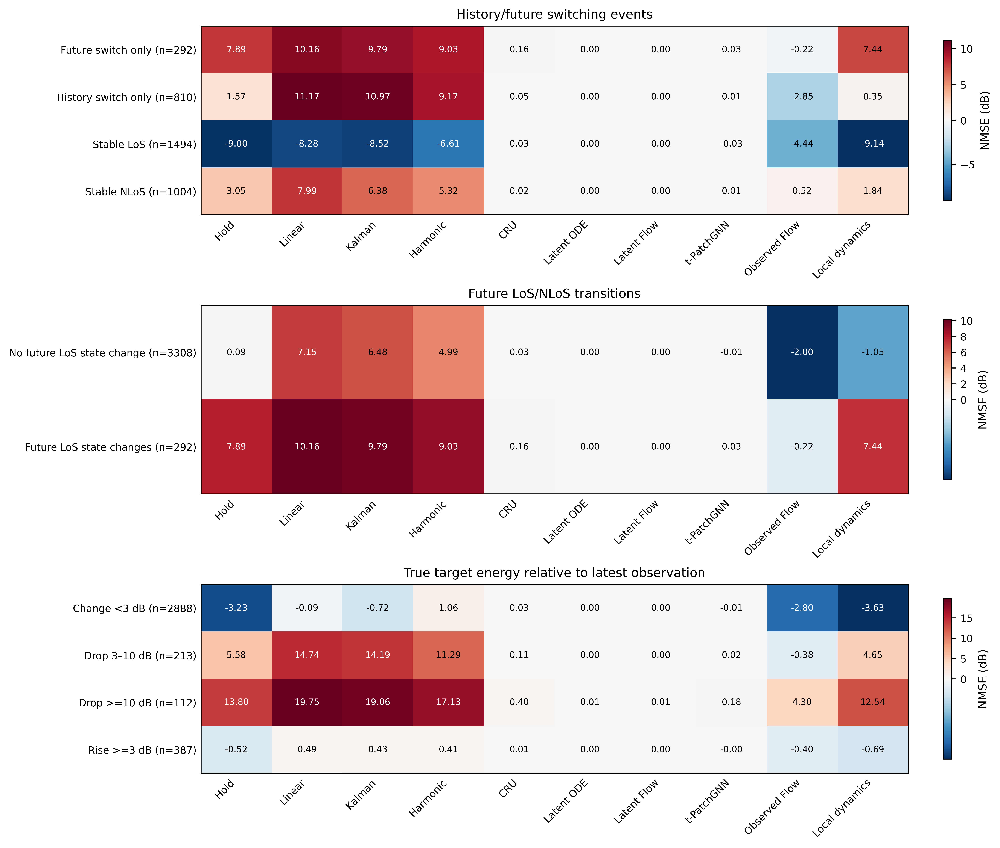

# 六类场景的非均匀时间戳 CSI 预测实验

本报告从保存的逐目标 CSV 重新计算；不重新训练或推理，不删除深衰落，不平滑指标，不裁剪正 NMSE。

## 实验问题与比较边界

六类分别训练，用于研究各运动与传播条件下单模态 CSI 的可预测性。类别并非互斥物理因素：前五类主要描述运动，遮挡类描述传播条件，不能将类别间全部差异归因于某个单一因素。

CRU、Latent ODE、Latent Neural Flow 和 t-PatchGNN 是原方法面向矩阵 CSI 的适配；Observed Flow 是保留已观测 CSI 状态的修复适配；Local dynamics 是另行设计的轻量局部动态诊断。它们的编码器、潜变量维数、状态锚点和输出结构不完全相同，因此不是只替换连续时间核心的严格架构消融，更不能把后两者冒充原论文方法。

所有方法只能读取历史 CSI、历史时间戳及查询时刻。LoS、通道组和衰落标签仅用于结果分组。前五类来自原分类数据，第六类来自新空间通道划分的遮挡数据；数据配置与checkpoint以各运行保存的配置为准。

预测对象是以收发阵列中心几何距离为传播参考的完整复数CSI，不是保留未知绝对载波相位的原始CSI。所有方法使用相同参考定义；模型不输入未来位置，也不在评价时对每个预测做oracle相位对齐。恢复绝对传播参考需要另外知道对应几何时延，不能把这里的结果直接解释为已预测该绝对相位。

前五类复用原训练集拟合的128维复数PCA（256维实数输入）；新遮挡类使用新TRAIN拟合的256维复数PCA（512维实数输入）。后者是基于TRAIN/VAL重建精度选择，不使用TEST选维。每个数据集内部的学习方法共享同一PCA，但跨类别输入维度并不完全相同。

每类每轮4000个TRAIN窗口，VAL固定600窗口，最多60轮。CRU批量512；Latent ODE和Latent Flow为256；t-PatchGNN前五类64、新遮挡类16；Observed Flow为128；Local dynamics为256。因此每轮优化更新次数及计算开销不同，不能称为只改变模型核心的严格等预算消融。Neural Flow早停耐心10，其余12。部分同数据、同实现、同配置的已完成权重通过REUSED.json复用，不把复用模型记为重新训练。

## 指标与统计口径

主指标先对每个目标计算完整复数矩阵误差与该目标能量的比值，在线性域等权平均后转 dB；不是逐目标 dB 的算术平均。另列能量加权误差、中位数、90分位和低于0 dB的比例。负 NMSE 只是优于零输出，不等于优于保持。

同一模型三个种子先在相同目标上平均线性误差，再计算总体分数。种子范围另行列出，种子不作为新增独立轨迹。95%区间按独立轨迹聚类重采样；新遮挡类按 channel_group 重采样，不能把同一通道的三条变体当作独立组。若缺少通道ID，该类区间标记不可用，不回退成逐轨迹区间。每类独立组很少，区间精度有限。

与保持法或干净时间戳的差值只在样本ID、轨迹和查询时刻完全一致时计算。负差值代表更好；未匹配窗口不强行求配对差。跨类宏平均先对每类线性NMSE求均值，避免窗口数更多的类别自动占据更大权重。

## 完成状态

已读取 984 个逐目标结果文件、形成 840 个实验/类别/方法汇总。

主实验与真实离网格查询的全部预定方法/种子已存在。受控条件的可用运行另见原始汇总表。

受控采样/时间戳/近期观测缺失实验尚缺 0 个方法条件；完整列表同样保存在manifest。

## 不同场景与预测提前量

主实验使用每类固定测试窗口及六个未来查询提前量。首先比较完整目标上的误差，再查看差异是否集中在某个预测距离。跨种子均值不能掩盖某个种子近零输出或训练失效。

| 类别 | 方法 | 种子数 | NMSE/dB | 95%组区间/dB | 相对保持/dB |
|---|---|---:|---:|---|---:|
| Climb/descent | CRU | 3 | -1.790 | [-7.95, 1.43] | +9.810 |
| Climb/descent | Harmonic | 1 | -5.817 | [-11.10, -3.56] | +5.783 |
| Climb/descent | Hold | 1 | -11.600 | [-15.55, -9.90] | — |
| Climb/descent | Kalman | 1 | -11.302 | [-13.83, -9.70] | +0.298 |
| Climb/descent | Latent ODE | 3 | -2.199 | [-6.46, 0.55] | +9.401 |
| Climb/descent | Linear | 1 | -12.307 | [-14.58, -10.58] | -0.706 |
| Climb/descent | Local dynamics | 3 | -12.493 | [-16.57, -10.76] | -0.893 |
| Climb/descent | Latent Flow | 3 | -0.879 | [-2.35, 0.52] | +10.721 |
| Climb/descent | Observed Flow | 3 | -13.025 | [-16.22, -11.48] | -1.425 |
| Climb/descent | t-PatchGNN | 3 | -4.239 | [-4.58, -3.86] | +7.362 |
| Cruise | CRU | 3 | -5.234 | [-6.01, -4.69] | +7.141 |
| Cruise | Harmonic | 1 | -6.103 | [-9.02, -4.11] | +6.272 |
| Cruise | Hold | 1 | -12.375 | [-14.03, -11.36] | — |
| Cruise | Kalman | 1 | -14.201 | [-16.79, -12.91] | -1.826 |
| Cruise | Latent ODE | 3 | -4.635 | [-5.09, -4.37] | +7.740 |
| Cruise | Linear | 1 | -14.001 | [-16.52, -12.64] | -1.626 |
| Cruise | Local dynamics | 3 | -13.830 | [-15.90, -12.80] | -1.455 |
| Cruise | Latent Flow | 3 | -1.206 | [-1.62, -0.82] | +11.170 |
| Cruise | Observed Flow | 3 | -14.440 | [-16.05, -13.64] | -2.065 |
| Cruise | t-PatchGNN | 3 | -4.403 | [-4.53, -4.29] | +7.972 |
| High speed | CRU | 3 | -2.437 | [-7.01, -0.27] | +5.508 |
| High speed | Harmonic | 1 | 0.062 | [-2.86, 2.52] | +8.007 |
| High speed | Hold | 1 | -7.945 | [-9.18, -6.81] | — |
| High speed | Kalman | 1 | -5.594 | [-8.54, -3.45] | +2.351 |
| High speed | Latent ODE | 3 | -2.225 | [-5.52, -0.53] | +5.720 |
| High speed | Linear | 1 | -5.060 | [-8.00, -2.84] | +2.885 |
| High speed | Local dynamics | 3 | -8.202 | [-9.62, -7.02] | -0.257 |
| High speed | Latent Flow | 3 | -0.472 | [-1.78, 0.18] | +7.473 |
| High speed | Observed Flow | 3 | -8.921 | [-10.39, -7.78] | -0.976 |
| High speed | t-PatchGNN | 3 | -3.734 | [-4.15, -3.48] | +4.211 |
| Occlusion | CRU | 3 | 0.042 | [0.02, 0.07] | -1.535 |
| Occlusion | Harmonic | 1 | 5.497 | [3.73, 6.42] | +3.920 |
| Occlusion | Hold | 1 | 1.577 | [-0.07, 2.83] | — |
| Occlusion | Kalman | 1 | 6.862 | [3.92, 8.80] | +5.285 |
| Occlusion | Latent ODE | 3 | 0.002 | [0.00, 0.00] | -1.575 |
| Occlusion | Linear | 1 | 7.486 | [3.93, 9.88] | +5.909 |
| Occlusion | Local dynamics | 3 | 0.684 | [-0.30, 1.49] | -0.893 |
| Occlusion | Latent Flow | 3 | 0.002 | [0.00, 0.00] | -1.576 |
| Occlusion | Observed Flow | 3 | -1.824 | [-3.37, -0.51] | -3.401 |
| Occlusion | t-PatchGNN | 3 | -0.005 | [-0.02, 0.00] | -1.582 |
| Turning | CRU | 3 | -0.444 | [-5.77, 1.52] | +10.062 |
| Turning | Harmonic | 1 | -4.778 | [-7.63, -2.33] | +5.727 |
| Turning | Hold | 1 | -10.505 | [-14.69, -9.20] | — |
| Turning | Kalman | 1 | -10.778 | [-17.23, -8.34] | -0.272 |
| Turning | Latent ODE | 3 | -0.970 | [-4.41, 0.11] | +9.535 |
| Turning | Linear | 1 | -10.469 | [-17.06, -8.07] | +0.037 |
| Turning | Local dynamics | 3 | -10.763 | [-15.11, -9.31] | -0.257 |
| Turning | Latent Flow | 3 | -0.121 | [-0.77, 0.29] | +10.385 |
| Turning | Observed Flow | 3 | -11.295 | [-15.58, -9.59] | -0.789 |
| Turning | t-PatchGNN | 3 | -3.496 | [-3.82, -3.31] | +7.009 |
| U-turn | CRU | 3 | -0.534 | [-4.81, 1.40] | +8.535 |
| U-turn | Harmonic | 1 | -2.302 | [-8.08, -0.90] | +6.767 |
| U-turn | Hold | 1 | -9.070 | [-10.08, -8.01] | — |
| U-turn | Kalman | 1 | -8.569 | [-9.25, -7.90] | +0.501 |
| U-turn | Latent ODE | 3 | -1.468 | [-6.79, 0.29] | +7.602 |
| U-turn | Linear | 1 | -8.195 | [-8.88, -7.19] | +0.874 |
| U-turn | Local dynamics | 3 | -9.600 | [-10.38, -8.50] | -0.530 |
| U-turn | Latent Flow | 3 | -0.034 | [-0.78, 0.42] | +9.035 |
| U-turn | Observed Flow | 3 | -9.816 | [-10.80, -8.36] | -0.747 |
| U-turn | t-PatchGNN | 3 | -3.759 | [-4.16, -3.43] | +5.311 |




Cruise：已齐种子的学习方法中，跨种子均值低于同窗保持的有：Local dynamics、Observed Flow。这是观察到的均值比较，不自动代表统计显著或每个提前量、每条轨迹均胜出。

High speed：已齐种子的学习方法中，跨种子均值低于同窗保持的有：Local dynamics、Observed Flow。这是观察到的均值比较，不自动代表统计显著或每个提前量、每条轨迹均胜出。

Turning：已齐种子的学习方法中，跨种子均值低于同窗保持的有：Local dynamics、Observed Flow。这是观察到的均值比较，不自动代表统计显著或每个提前量、每条轨迹均胜出。

U-turn：已齐种子的学习方法中，跨种子均值低于同窗保持的有：Local dynamics、Observed Flow。这是观察到的均值比较，不自动代表统计显著或每个提前量、每条轨迹均胜出。

Climb/descent：已齐种子的学习方法中，跨种子均值低于同窗保持的有：Local dynamics、Observed Flow。这是观察到的均值比较，不自动代表统计显著或每个提前量、每条轨迹均胜出。

Occlusion：已齐种子的学习方法中，跨种子均值低于同窗保持的有：CRU、Latent ODE、Local dynamics、Latent Flow、Observed Flow、t-PatchGNN。这是观察到的均值比较，不自动代表统计显著或每个提前量、每条轨迹均胜出。

CRU：在已齐种子且有保持对照的 36 个类别—提前量条件中，3 个均值优于保持。全部提前量均纳入这一计数，不只保留有利区间。

Latent ODE：在已齐种子且有保持对照的 36 个类别—提前量条件中，3 个均值优于保持。全部提前量均纳入这一计数，不只保留有利区间。

Latent Flow：在已齐种子且有保持对照的 36 个类别—提前量条件中，3 个均值优于保持。全部提前量均纳入这一计数，不只保留有利区间。

t-PatchGNN：在已齐种子且有保持对照的 36 个类别—提前量条件中，4 个均值优于保持。全部提前量均纳入这一计数，不只保留有利区间。

Observed Flow：在已齐种子且有保持对照的 36 个类别—提前量条件中，34 个均值优于保持。全部提前量均纳入这一计数，不只保留有利区间。

Local dynamics：在已齐种子且有保持对照的 36 个类别—提前量条件中，33 个均值优于保持。全部提前量均纳入这一计数，不只保留有利区间。

## 真实离网格未来查询

离网格目标来自真实射线追踪，不是相邻CSI线性插值得到的标签。图中并列给出主实验和离网格结果；两者查询提前量分布与截止窗口可能不同，因此跨图分数变化不能单独归因为“非网格时间更难”。实际连续查询按提前量区间的完整统计见 `tables/offgrid_horizon_bands.csv`。



Climb/descent的已齐离网格学习方法中，6/6 个总体NMSE为负，分数范围为 -11.832 至 -0.778dB。这描述实际连续查询标签上的结果，不把它与密集网格均值的差解释为单一采样因素。

Cruise的已齐离网格学习方法中，6/6 个总体NMSE为负，分数范围为 -12.797 至 -1.091dB。这描述实际连续查询标签上的结果，不把它与密集网格均值的差解释为单一采样因素。

High speed的已齐离网格学习方法中，6/6 个总体NMSE为负，分数范围为 -7.260 至 -0.433dB。这描述实际连续查询标签上的结果，不把它与密集网格均值的差解释为单一采样因素。

Occlusion的已齐离网格学习方法中，2/6 个总体NMSE为负，分数范围为 -0.832 至 2.376dB。这描述实际连续查询标签上的结果，不把它与密集网格均值的差解释为单一采样因素。

Turning的已齐离网格学习方法中，6/6 个总体NMSE为负，分数范围为 -9.361 至 -0.147dB。这描述实际连续查询标签上的结果，不把它与密集网格均值的差解释为单一采样因素。

U-turn的已齐离网格学习方法中，6/6 个总体NMSE为负，分数范围为 -8.127 至 -0.016dB。这描述实际连续查询标签上的结果，不把它与密集网格均值的差解释为单一采样因素。

## 不规则历史的数量与分布

受控实验固定种子17，每个条件使用相同目标窗口；分别改变16个历史观测的时间分布，或在随机分布下改变观测数量。各条件均保持相同历史跨度、未来查询范围和端点约束。均匀采样在密集离散网格上取整，并非所有数量下都严格等间隔。不能拿200窗口的受控实验与600窗口主实验直接相减解释收益。


count_random_n32：在已严格配对的 60 个类别—方法条件中，17 个均值退化超过0.01dB，17 个改善超过0.01dB，26 个差异在±0.01dB内；完整差值范围为 -0.564 至 +0.226dB。0.01dB只是显示精度的描述界限，不是统计显著性检验，配对区间保留在CSV。

count_random_n4：在已严格配对的 60 个类别—方法条件中，32 个均值退化超过0.01dB，6 个改善超过0.01dB，22 个差异在±0.01dB内；完整差值范围为 -0.119 至 +9.477dB。0.01dB只是显示精度的描述界限，不是统计显著性检验，配对区间保留在CSV。

count_random_n8：在已严格配对的 60 个类别—方法条件中，26 个均值退化超过0.01dB，8 个改善超过0.01dB，26 个差异在±0.01dB内；完整差值范围为 -0.051 至 +1.639dB。0.01dB只是显示精度的描述界限，不是统计显著性检验，配对区间保留在CSV。

pattern_bursty_n16：在已严格配对的 60 个类别—方法条件中，31 个均值退化超过0.01dB，1 个改善超过0.01dB，28 个差异在±0.01dB内；完整差值范围为 -0.015 至 +1.480dB。0.01dB只是显示精度的描述界限，不是统计显著性检验，配对区间保留在CSV。

pattern_dropout_n16：在已严格配对的 60 个类别—方法条件中，8 个均值退化超过0.01dB，19 个改善超过0.01dB，33 个差异在±0.01dB内；完整差值范围为 -0.498 至 +0.287dB。0.01dB只是显示精度的描述界限，不是统计显著性检验，配对区间保留在CSV。

pattern_uniform_n16：在已严格配对的 60 个类别—方法条件中，9 个均值退化超过0.01dB，17 个改善超过0.01dB，34 个差异在±0.01dB内；完整差值范围为 -0.414 至 +2.687dB。0.01dB只是显示精度的描述界限，不是统计显著性检验，配对区间保留在CSV。

## 报告时间戳不准确的影响

时间戳扰动不改变未来标签；仅调整内部历史时间，首尾时间固定，CSI及完整H随被扰动时间戳同步重排。统一内部时间标签或20ms扰动与同窗干净标签比较，保持法因最后观测不变而应保持原分数。该设置未覆盖全局传感器时钟偏移、漂移或最新观测本身的时间误差。图中为扰动后的NMSE减干净条件NMSE，正值代表退化。缺少完全匹配的clean运行时不计算差值。具体扰动规则以评估代码为准。



timestamps_jitter_20：在已严格配对的 60 个类别—方法条件中，8 个均值退化超过0.01dB，18 个改善超过0.01dB，34 个差异在±0.01dB内；完整差值范围为 -0.997 至 +0.054dB。0.01dB只是显示精度的描述界限，不是统计显著性检验，配对区间保留在CSV。

timestamps_uniform_times：在已严格配对的 60 个类别—方法条件中，22 个均值退化超过0.01dB，2 个改善超过0.01dB，36 个差异在±0.01dB内；完整差值范围为 -0.303 至 +18.332dB。0.01dB只是显示精度的描述界限，不是统计显著性检验，配对区间保留在CSV。

## 近期观测缺失

stale_50和stale_100保持16个真实随机历史观测，但最近一帧分别停在截止点前50或100ms；最早历史仍约为−0.4s。目标时刻保持不变，按实际可用历史重新归一化，与pattern_random_n16的相同目标配对比较。

这一实验同时改变历史覆盖范围、最近观测年龄，以及从最近CSI到预测目标的有效外推距离，反映更新延迟/近期观测缺失，不能解释成单纯时间戳误差或只改变内部采样间隔。其保持法也必须使用实际可用的最后一帧，不能借用已缺失的新观测。



stale_100：在已严格配对的 60 个类别—方法条件中，48 个均值退化超过0.01dB，1 个改善超过0.01dB，11 个差异在±0.01dB内；完整差值范围为 -0.080 至 +2.944dB。0.01dB只是显示精度的描述界限，不是统计显著性检验，配对区间保留在CSV。

stale_50：在已严格配对的 60 个类别—方法条件中，48 个均值退化超过0.01dB，1 个改善超过0.01dB，11 个差异在±0.01dB内；完整差值范围为 -0.044 至 +1.539dB。0.01dB只是显示精度的描述界限，不是统计显著性检验，配对区间保留在CSV。

## 遮挡切换与深衰落

LoS/NLoS切换不等于增益一定显著变化，持续NLoS中也可能因反射路径或多径相消产生深衰落。因此同时按事件类别、未来区间是否发生LoS状态变化，以及真实目标能量相对最后观测能量的变化分组。

深衰落描述阈值预设为相对最近观测下降至少10dB，另列下降3–10dB、变化小于3dB和上升至少3dB。阈值只用于描述，不删除样本、不修改损失、不根据模型误差定义“异常”。如果CSV没有真实最后观测能量或其比值，不能用预测增益误差替代这一物理标签。



当前下降至少10dB分组包含 112 个真实目标，这些目标全部保留于总体评价。不同模型在该组的误差占各自总逐目标NMSE和的比例为：

| 方法 | 该组NMSE/dB | 占该方法总NMSE和/% | 独立通道数 |
|---|---:|---:|---:|
| CRU | 0.404 | 3.38 | 3 |
| Harmonic | 17.131 | 45.32 | 3 |
| Hold | 13.804 | 51.95 | 3 |
| Kalman | 19.059 | 51.59 | 3 |
| Latent ODE | 0.008 | 3.12 | 3 |
| Linear | 19.747 | 52.36 | 3 |
| Local dynamics | 12.542 | 47.72 | 3 |
| Latent Flow | 0.012 | 3.12 | 3 |
| Observed Flow | 4.299 | 12.74 | 3 |
| t-PatchGNN | 0.179 | 3.25 | 3 |

这个占比用于判断相对误差是否被深衰落主导；占比高并不意味着应该删掉该组，也不能仅凭压低输出后的总体均值就认定恢复了更多信道结构。

## 可以与不可以据此得出的结论

只有在完整同窗目标上比保持更好，且跨种子与独立通道的结果一致时，才能较有把握地说方法利用了可预测动态。单纯NMSE负值、压低输出幅度改善深衰落尾部、或只展示最好种子，都不足以证明模型恢复了CSI结构。

本实验只研究CSI单模态。某个遮挡组预测困难可以定位未来多模态研究的条件，但不能直接证明图像一定有效；图像是否提供增量信息仍需独立多模态实验。若这些测试结果用于进一步改模型，应另留新的最终测试，不能把反复开发使用的集合称为盲测。

所有图均从表中精确值绘制，保留正NMSE和差模型，输出白底600dpi PNG及嵌入TrueType字体的PDF。置信区间、种子范围及原始来源哈希保留在CSV/JSON，而非靠图中近似读数。

## 文件

- `tables/`：逐运行、跨种子、按提前量、配对差、遮挡组及跨类宏平均。
- `figures/`：PNG和PDF。
- `report_manifest.json`：源码哈希、全部原始CSV哈希、缺失清单与警告。

## 从公开汇总表重新绘图

公开文件夹只需保留本说明、tables/、figures/及scripts/中的report.py和replay_figures.py。重画仅依赖numpy、pandas、matplotlib，不需要服务器上的CSI、checkpoint、ROS或百万行逐目标结果。

在公开文件夹根目录执行：

```bash
python scripts/replay_figures.py --tables tables --output reproduced
```

重画结果保存在reproduced/figures/，不会覆盖原图；figure_replay_manifest.json记录输入汇总表及两份脚本的哈希。该入口复现的是由已保存精确汇总值生成的图，不能在缺少逐目标数据时重新估计聚类置信区间或重新训练模型。
