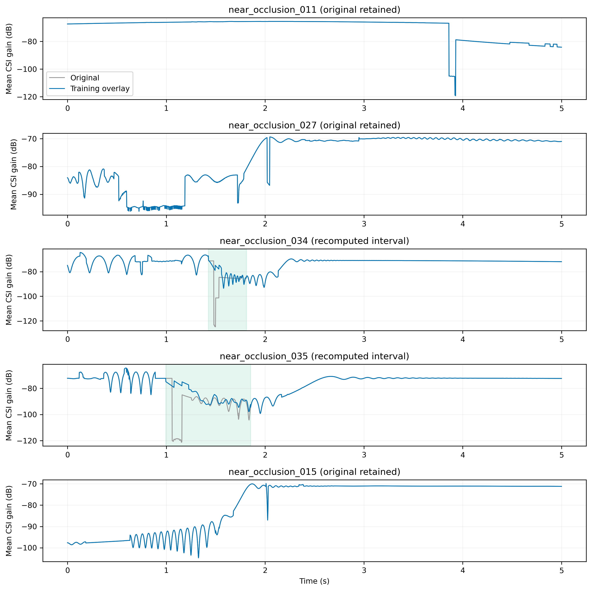
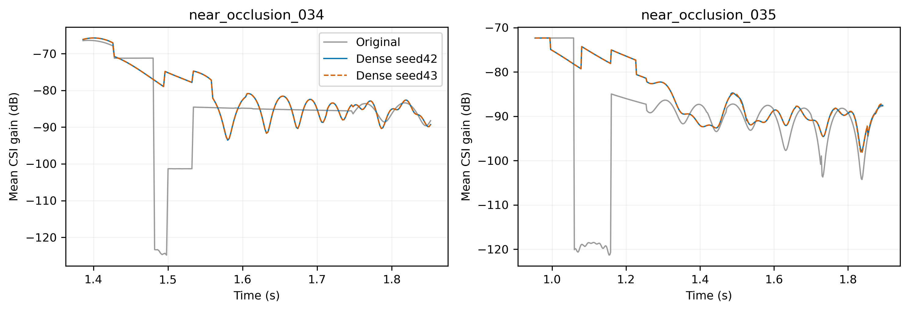
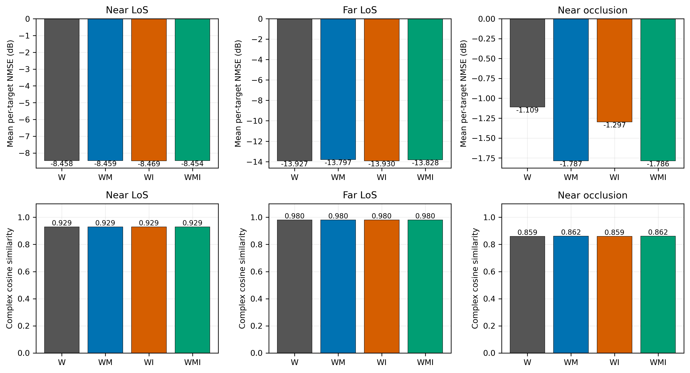
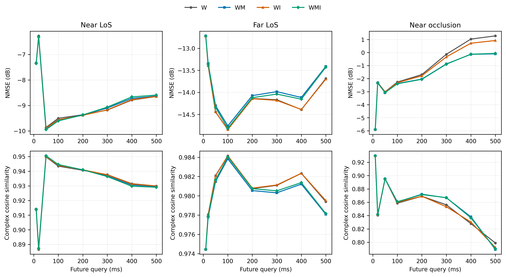
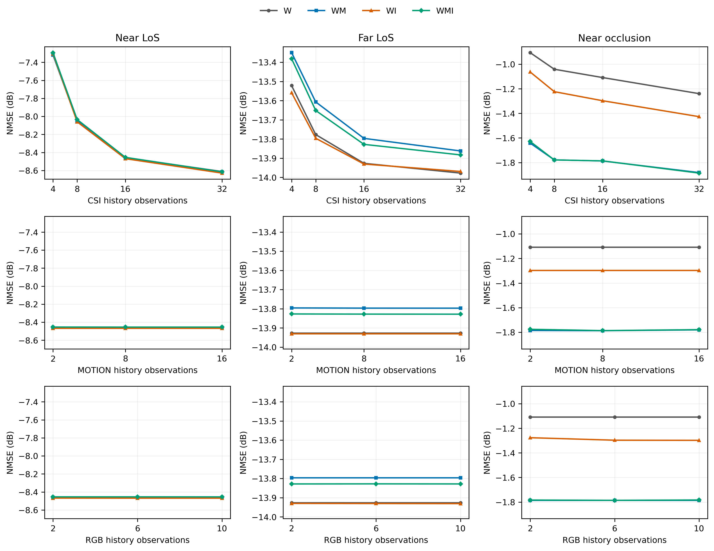
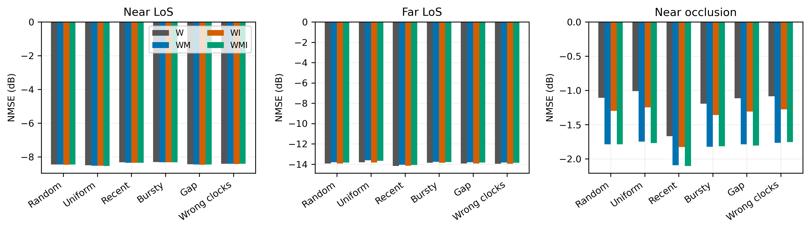
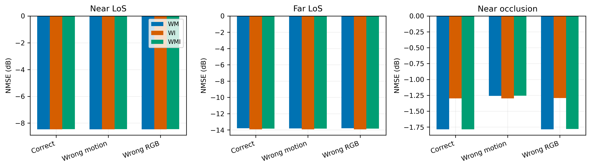
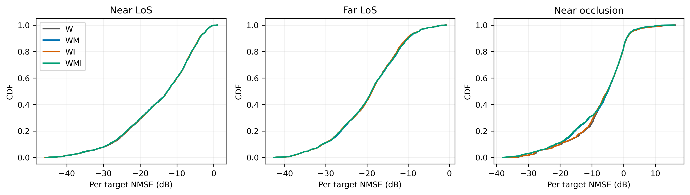
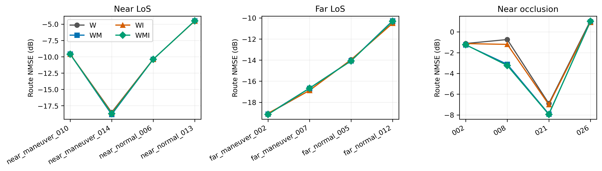

# 三类场景独立训练的异步多模态 CSI 预测

## CSI 修复范围

对指定的 11、27、34、35、15 分别尝试更密集的射线采样、独立随机种子和候选传播几何共享；另测试重合绕射路径去重。最终只采用保持原场景和传播开关不变、射线数提高到原来的 16 倍的 seed42 重算结果，并用 seed43 复核。候选共享和额外去重没有提供更可靠的改进，因此未采用。

| 轨迹 | 处理 | 替换时间/s | 修复区间最大相邻跳变/dB |
|---|---|---|---|
| near_occlusion_011 | 保留原值，未确认可靠修复 | — | — |
| near_occlusion_027 | 保留原值，未确认可靠修复 | — | — |
| near_occlusion_034 | 射线重算替换 | 1.426–1.812 | 52.13 → 4.93 |
| near_occlusion_035 | 射线重算替换 | 0.994–1.854 | 47.75 → 5.00 |
| near_occlusion_015 | 保留原值，未确认可靠修复 | — | — |

34 和 35 共替换 625 帧；替换区间外逐值不变，RGB/运动数据不变，原始文件不覆盖。替换前同时检查独立种子的完整复数 CSI 一致性、增益一致性和与原数据接缝的相位/幅度连续性。未平均种子、未按功率选择最强路径、未平滑 CSI。仍有约 5 dB 的局部小台阶，因此这是对严重数值掉落的局部改善，不是所有传播边界已完全收敛的声明。

11 的大变化含 LoS 消失及 NLoS 路径切换，当前重算未稳定消除；27 的部分跳变仍存在；15 的跳变在高射线数独立种子下仍出现。不能仅以“变化大”断言全为伪影。34、35、11、15 属于原训练集，27 属于原验证集，本次没有修补测试轨迹或按照预测测试误差筛选样本。

## 实验设置

将近距离正常和高机动合为近距离 LoS，远距离正常和高机动合为远距离 LoS，另保留近距离遮挡组。每组 40 条五秒轨迹，沿用原轨迹级划分：32 条训练、4 条验证、4 条测试。三个数据集分别训练 W（CSI）、WM（CSI＋位置速度）、WI（CSI＋四视角 RGB）、WMI（全部模态），共 12 个从随机参数初始化的预测网络；未加载旧预测器权重。RGB 编码器沿用冻结 ImageNet ResNet50。这里的 LoS 是轨迹场景分组名称，不等于逐时刻路径审计的替代。

数据为 500 Hz、64×16 复数 CSI，100 Hz 三维位置速度和 20 Hz 四视角 RGB。CSI 使用几何距离参考相位，保留剩余复相位；基站、地图、天线配置和 RGB 不变。近距离遮挡指定五条轨迹的修复依据射线重算及一致性检查，而非模型测试误差；原始文件全部保留，替换记录见 repair_summary.json 和修复图。

历史和未来范围均为 500 ms。预测起点按 50 ms 滑动，每条 81 个窗口、每组每轮 2592 个训练窗口；训练起点抖动不超过 24 ms。各轮重新采样不同数量及时间戳：CSI 4–32、位置速度 2–16、RGB 2–10 个四视角时刻。固定保留截止时刻最新 CSI，辅助观测不晚于截止时刻。每个未来区间六等分，每份随机查询一个点。测试查询为 10/20/50/100/200/300/400/500 ms，默认输入数量为 16/8/6。非网格目标由相邻 500 Hz 复 CSI 线性插值；不把这一近似当作无限时间分辨率。四模型评估观测和标签严格配对。

预测结构沿用本轮之前的统一训练骨架：逐 CSI 复系数共享 32 维编码、时间感知跨模态历史融合、两层时序注意力、连续查询解码；输出最新 CSI 与复数倍率、复数修正量的组合。输入及目标共用历史能量归一化，不使用未来能量。位置相对基站除以 100，速度除以 20。图像保留四视角空间 patch，当前帧空间中心化及历史差分后参与注意力，不用测试集背景统计。

训练设置一致：AdamW，学习率 1e−4、权重衰减 0.003、有效 batch 64、最多 50 轮、至少 15 轮、验证集耐心 10 轮，bfloat16、梯度裁剪 1。仅按验证集逐目标平均线性 NMSE 选 checkpoint。采用一个随机种子。

## 指标定义

- NMSE：每个目标完整复矩阵误差能量除以真实能量，对目标等权平均后取 10log10；同时给出中位数、90 分位和能量加权 NMSE。深衰落非零目标不删除。
- 复数余弦相似度：复内积的绝对值除以两个矩阵范数乘积，范围 0–1；它忽略一个整体复相位，不能代替完整复 CSI 的 NMSE。另给出实虚向量余弦（不取复内积绝对值）来保留相位敏感性。零预测的相似度按 0 计并单列数量；零真值的普通 NMSE/余弦不定义。
- 辅助报告幅度 NMSE、公共相位对齐 NMSE、最差 1% 样本误差占比。保持/线性外推是参考，不参与模型选择。

## 主结果

| 场景 | 模型 | 最优轮 | NMSE/dB | 中位数/dB | 复数余弦 | 实虚余弦 |
|---|---|---:|---:|---:|---:|---:|
| near_los | W | 46 | -8.458 | -12.548 | 0.9291 | 0.9261 |
| near_los | WM | 50 | -8.459 | -12.553 | 0.9292 | 0.9260 |
| near_los | WI | 46 | -8.469 | -12.583 | 0.9293 | 0.9262 |
| near_los | WMI | 50 | -8.454 | -12.560 | 0.9291 | 0.9260 |
| far_los | W | 48 | -13.927 | -18.727 | 0.9803 | 0.9797 |
| far_los | WM | 44 | -13.797 | -18.894 | 0.9797 | 0.9791 |
| far_los | WI | 44 | -13.930 | -18.720 | 0.9803 | 0.9798 |
| far_los | WMI | 44 | -13.828 | -18.913 | 0.9799 | 0.9793 |
| near_occlusion | W | 37 | -1.109 | -5.134 | 0.8595 | 0.6846 |
| near_occlusion | WM | 42 | -1.787 | -4.916 | 0.8616 | 0.6891 |
| near_occlusion | WI | 37 | -1.297 | -5.122 | 0.8589 | 0.6851 |
| near_occlusion | WMI | 42 | -1.786 | -5.062 | 0.8616 | 0.6896 |

各组的最低测试误差只用于描述，不用于重新挑选 checkpoint：

- near_los：WI 最低，为 -8.469 dB；相对 W 的线性 NMSE 降低 0.25%。
  位置速度带来的变化（WM−W）为 -0.001 dB；图像变化（WI−W）为 -0.011 dB；已有运动信息时再加图像（WMI−WM）为 +0.005 dB，负值代表改善。
- far_los：WI 最低，为 -13.930 dB；相对 W 的线性 NMSE 降低 0.09%。
  位置速度带来的变化（WM−W）为 +0.130 dB；图像变化（WI−W）为 -0.004 dB；已有运动信息时再加图像（WMI−WM）为 -0.031 dB，负值代表改善。
- near_occlusion：WM 最低，为 -1.787 dB；相对 W 的线性 NMSE 降低 14.45%。
  位置速度带来的变化（WM−W）为 -0.678 dB；图像变化（WI−W）为 -0.188 dB；已有运动信息时再加图像（WMI−WM）为 +0.001 dB，负值代表改善。

| 场景 | 保持 NMSE/dB | 最近两点线性外推 NMSE/dB |
|---|---:|---:|
| near_los | -5.815 | 18.699 |
| far_los | -12.636 | 15.515 |
| near_occlusion | 3.819 | 29.309 |

## 数量、时间戳和模态利用

数量实验每次只改变一个流的数量，保持其他流及预测目标不变。CSI 数量始终包含 t=0 锚点。不同数量的抽样不是严格嵌套子集，因此曲线反映该确定性抽样协议的结果，不能把小幅非单调变化直接解释为信息有害。

随机、均匀、近期密集、成簇和缺口改变实际观测分布；Wrong clocks 保持观测值不变，只把每个流内部时间间隔标成均匀。它是推理时钟扰动诊断，不等于已经训练了强制对齐基线，也不能据此证明所有插值方法更差。

- near_los，WMI：4→32 个 CSI 时 NMSE -7.296→-8.615 dB；错误时钟相对正确时钟变化 +0.044 dB。
- far_los，WMI：4→32 个 CSI 时 NMSE -13.381→-13.883 dB；错误时钟相对正确时钟变化 -0.028 dB。
- near_occlusion，WMI：4→32 个 CSI 时 NMSE -1.628→-1.886 dB；错误时钟相对正确时钟变化 +0.031 dB。

辅助输入打乱使用同一测试组另一条轨迹在同一相对时刻的观测；CSI 和目标保持不变。这是信息依赖诊断，也存在分布外输入影响，并非因果证明。

- near_los/WM：错误运动输入变化 -0.0000 dB；错误图像输入变化 +0.0000 dB。
- near_los/WI：错误运动输入变化 +0.0000 dB；错误图像输入变化 +0.0005 dB。
- near_los/WMI：错误运动输入变化 +0.0096 dB；错误图像输入变化 +0.0001 dB。
- far_los/WM：错误运动输入变化 -0.0081 dB；错误图像输入变化 +0.0000 dB。
- far_los/WI：错误运动输入变化 +0.0000 dB；错误图像输入变化 -0.0002 dB。
- far_los/WMI：错误运动输入变化 +0.0011 dB；错误图像输入变化 -0.0000 dB。
- near_occlusion/WM：错误运动输入变化 +0.5290 dB；错误图像输入变化 +0.0000 dB。
- near_occlusion/WI：错误运动输入变化 +0.0000 dB；错误图像输入变化 +0.0051 dB。
- near_occlusion/WMI：错误运动输入变化 +0.5292 dB；错误图像输入变化 +0.0048 dB。

图像组合即使优于 W，也不自动证明网络识别了遮挡。如果换错图像几乎不改变结果，仍需考虑图像分支主要提供常量偏置、目标过小或冻结特征不敏感，而不能直接宣称视觉语义有增益。

## 误差集中与结论边界

每组只有四条独立测试轨迹，滑动窗口相关。paired_route_bootstrap.csv 对整条轨迹重采样，区间仅供小样本参考，不把 2592 个目标当成 2592 条独立轨迹。本次只训练一个种子，不能证明训练随机性下显著优劣。

本实验回答的是分场景训练后的预测能力、模态增量价值和输入扰动敏感性；不验证跨地图泛化，也没有以测试误差筛除轨迹。不同场景分开训练改变了训练分布，不能把与旧统一模型的差别全部归因于架构。近距离遮挡中仍可靠存在的物理突变/衰落保留。

## 主要判断

1. 三组的四种模型在测试集上的平均 NMSE 均为负，并优于同输入的保持参考，说明本次训练能够学习到历史 CSI 的演化。但这不等于每个预测提前量或每条轨迹都预测良好。近距离遮挡的 near_occlusion_026 在四模型上仍约为 +0.93 至 +1.06 dB；W 和 WI 在 400–500 ms 时的平均 NMSE 也仍为正。
2. 两个 LoS 组增加模态基本没有收益。近距离四模型相差约 0.015 dB，远距离运动组合略差；不能把细微排名解释为模态优劣。远距离本身比近距离更容易预测这一现象，仅适用于这两组具体轨迹、速度和几何配置，不能归纳为距离越远越容易。
3. 近距离遮挡中的运动模态有可观测的贡献：WM 相比 W 改善约 0.68 dB，换错运动输入后退化约 0.53 dB。改善并不均匀，near_occlusion_008 的改善最大，near_occlusion_026 改善很少。W 的最差 1% 目标贡献约 26.8% 的总 NMSE，WM 降为约 20.4%；WM 的中位数反而略差，因此平均改善主要体现为部分高误差目标得到缓解，不是所有样本都变好。
4. 图像的语义贡献仍未得到充分证实。遮挡中 WI 相比 W 有约 0.19 dB 改善，但换错 RGB 只影响约 0.005 dB；WMI 与 WM 几乎相同。现有证据更支持“模型未明显利用随轨迹变化的视觉内容”，不能把这点差异直接归因于看见了无人机或遮挡。固定背景占比、目标像素大小、冻结特征和融合结构都是待区分的原因。
5. 遮挡中复数余弦约 0.86，实虚向量余弦约 0.68–0.69，两者差距表明整体相位误差不可忽略；相位对齐后 NMSE 更好，但仍不是完整 CSI 预测结果。该对齐指标只用于诊断，不用于修正模型输出。
6. 更多历史 CSI 有一定收益，但错标内部时间间隔的影响很小，且远距离组略有改善。本次仍不足以支持“原生异步建模显著优于插值对齐”的核心主张；需要另外训练并公平比较对齐基线、真实时间编码消融及不同观测稀疏度。不能用目前的微小扰动差异替代这项验证。
7. 预测提前量曲线并非全部单调。特别是近距离 LoS 的 10/20 ms 误差高于 50 ms，这在四种组合中都出现。当前仅保留这一真实结果，不做曲线平滑；通道自身相关性、查询/滑窗网格以及短提前量的输出参数化均可能参与，尚未通过独立实验区分，不能给出单一原因。

## 文件

PNG/PDF 来自本目录 CSV 及本地保存的逐目标 NPZ；所有原始评估分子、分母和预测能量保存在服务器。模型 best.pt/latest.pt、训练配置、逐轮日志、修复候选和最终覆盖数据均位于 `/root/autodl-tmp/csi-three-regimes-20260910/`。没有修改旧实验目录的原始 CSI 或权重。
