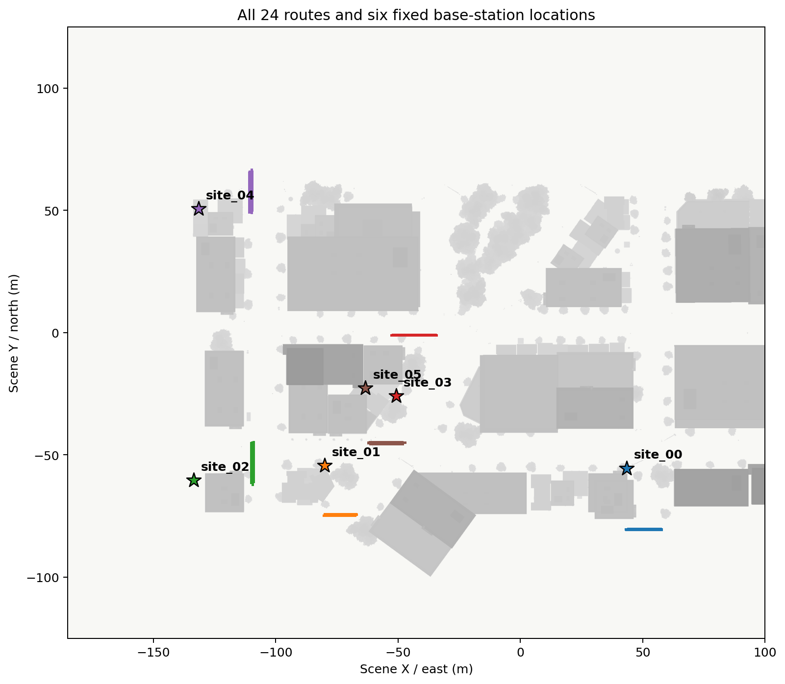
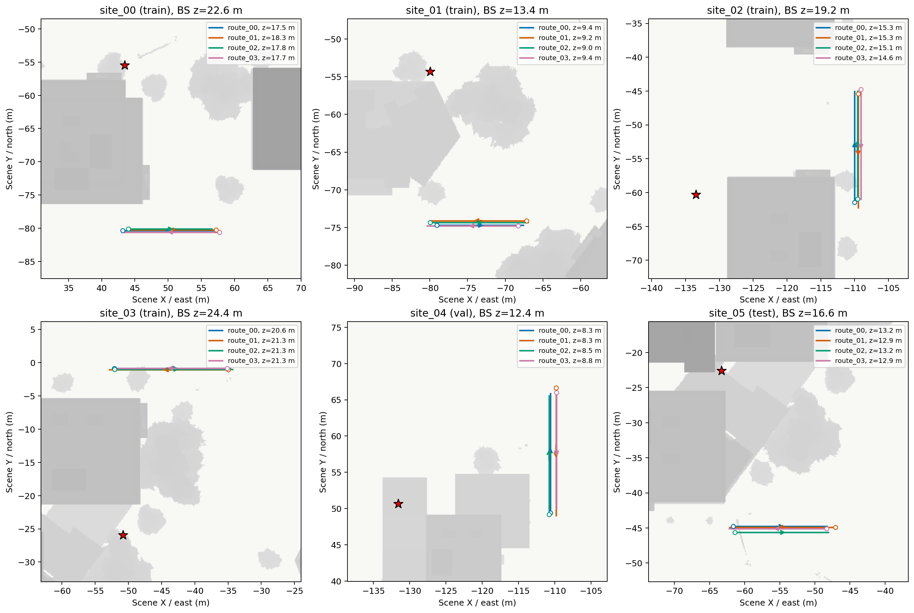
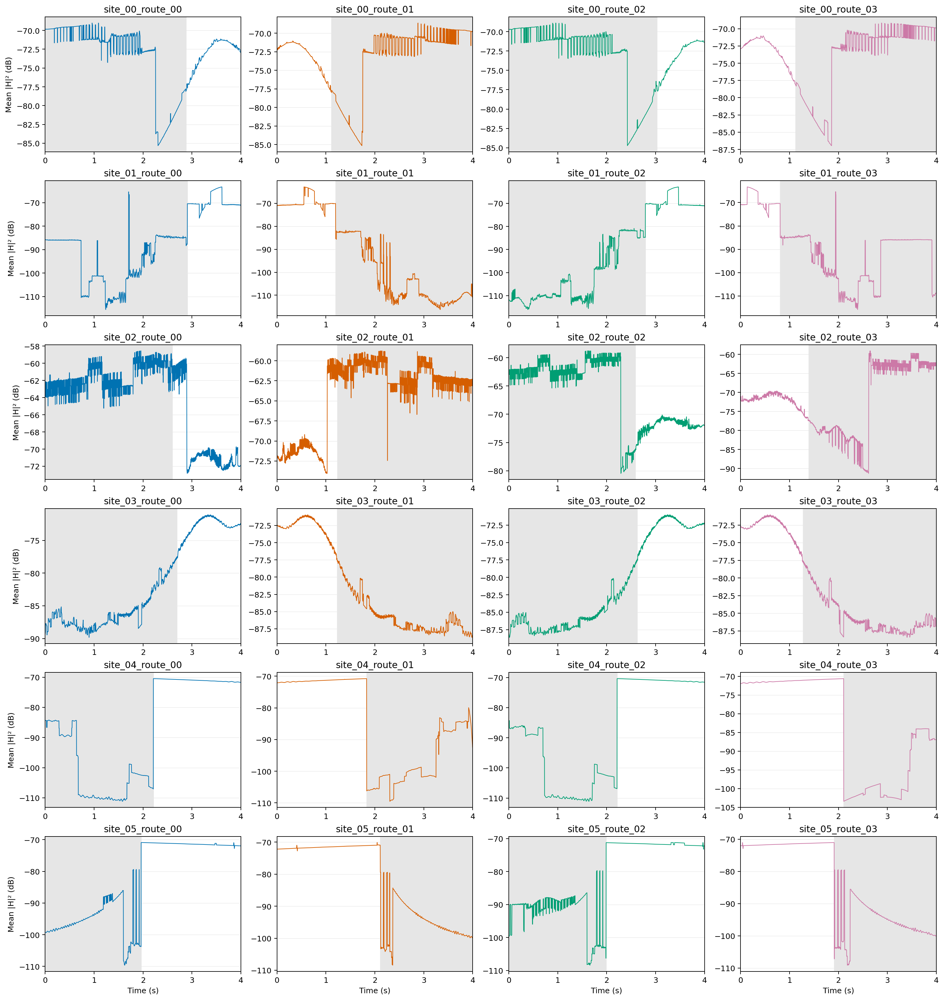
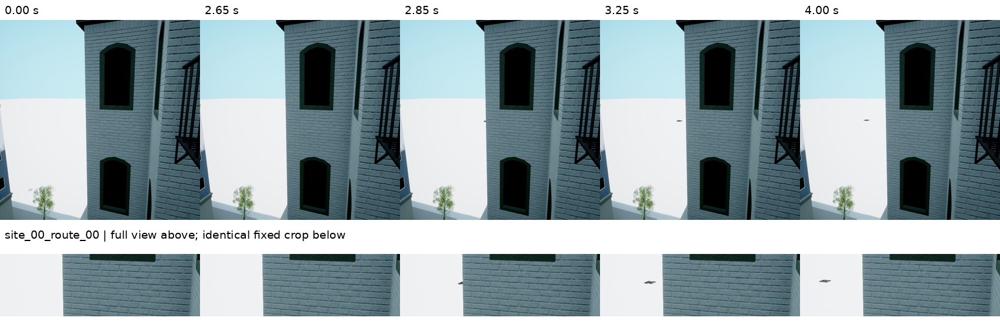
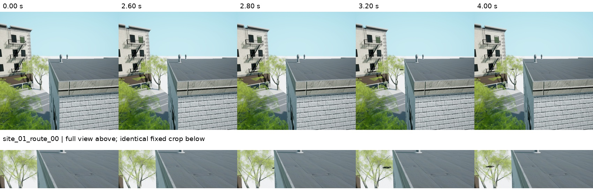
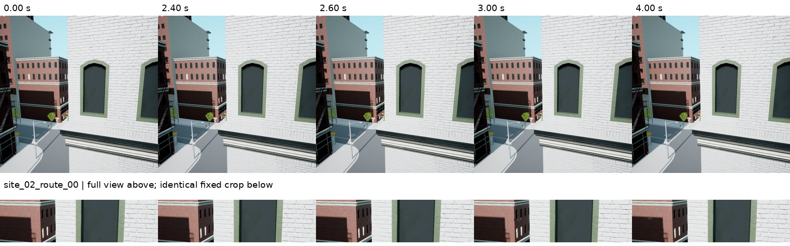
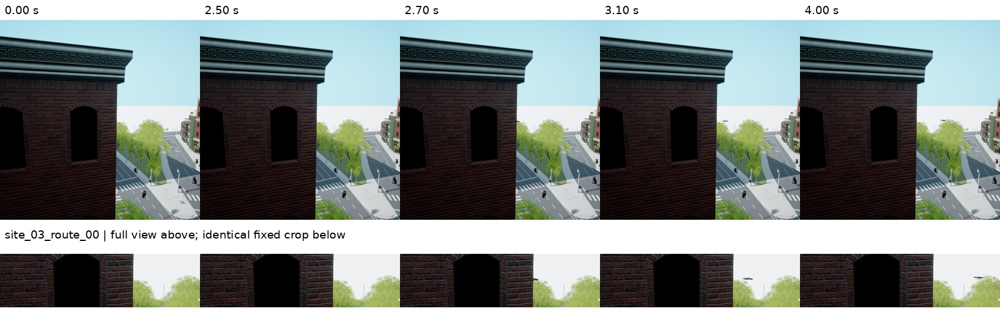
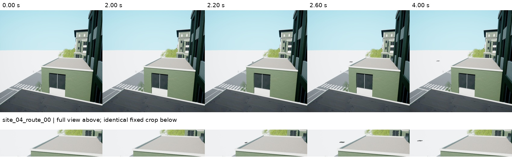
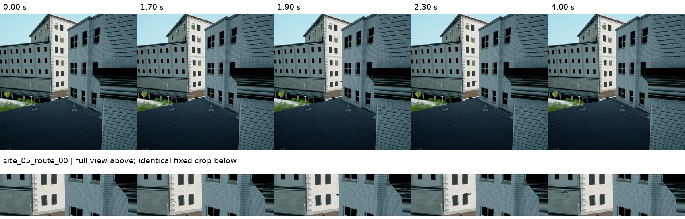
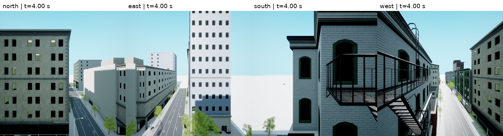

# 新遮挡多模态数据集可视化

6 处场景，每处 4 条轨迹，共 24 条；每条 4 秒。基站及相机在同一场景内固定。CSI 为 500 Hz、64×128 复数矩阵；RGB 和运动状态为 20 Hz。这里展示最终 `mixed_chain_union` 候选搜索版本，不是早期试算结果。原始数据位于服务器 `/root/autodl-tmp/csi-visual-occlusion-v1/dataset/`。

## 路径与基站

底图来自实际导出的 UE 城市网格的俯视投影，不是建筑包围盒；灰色表示高于地面 1 米的投影表面。坐标使用已校准的 SimART 米制坐标，上北下南。星号为基站位置。



每个场景包含四条邻近变体，部分线条会重叠。空心圆为起点，箭头为运行方向，图例列出各条轨迹高度；标题列出基站高度。



## 所有路径的 CSI 增益

每个子图对应一条轨迹，每行对应一个场景。曲线直接使用全部 2,001 个 CSI 时刻，计算天线和子载波维度上的平均模平方后转为 dB：`10 log10(mean(|H|²))`。没有平滑、插值或剔除异常点；这不是乘上发射功率后的接收功率。灰色时间区间表示射线求解结果中没有直达路径（NLoS），不等同于图像里无人机完全不可见。各子图纵轴独立，比较时需注意刻度。保留了快速变化和遮挡边界跳变。



[打开矢量 PDF 查看细节](03_csi_gain_all_routes.pdf) · [下载全部曲线数值 CSV](csi_gain_all_routes.csv)

## 精简 RGB 序列

每个场景选择 `route_00` 的固定定向相机，取 5 帧，覆盖遮挡前后。上排是完整画面，下排是整个序列使用同一个裁剪区域的放大图；不逐帧跟踪、不添加检测框、不修改原始图像内容。时间标在每列上方。具体帧号和裁剪区域记录在 [rgb_selection.json](rgb_selection.json)。








另外以 `site_00_route_00` 的同一时刻展示四个水平广角相机，说明原始四方向数据的视野。无人机不必同时出现在四个方向。



## 文件与复现

- `plot_data.npz`：全部增益、时间戳、LoS、用于绘图的 20 Hz 轨迹坐标及基站坐标；无需下载完整 CSI 即可读取曲线数值。
- `manifest.json`：24 条轨迹的场景、坐标及配置摘要。
- `export_visualizations.py`：从原始数据导出上述全部图像的脚本；地图网格路径从原始数据配置读取。
- 本目录只上传可视化、绘图数值和脚本，不上传完整 RGB、CSI 或模型。

服务器复现：

```bash
/root/miniconda3/envs/SimART/bin/python /root/autodl-tmp/csi-visual-occlusion-v1/export_visualizations.py --dataset /root/autodl-tmp/csi-visual-occlusion-v1/dataset --output /tmp/visual_occlusion_figures
```
